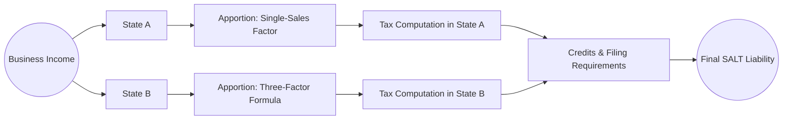
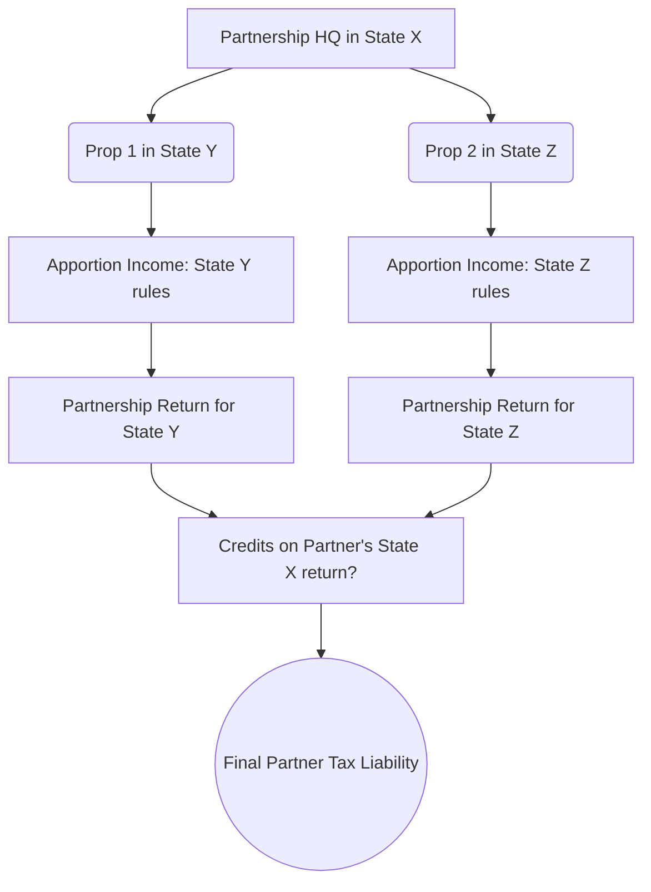

## 23.4 SALT Planning Opportunities & Risk Areas

State and Local Tax (SALT) compliance and planning have become increasingly significant as states pursue revenue, expand nexus rules, and place heightened scrutiny on cross-border transactions. Whether dealing with pass-through entities (PTEs), multi-state C Corporations, or individuals with cross-state income, SALT presents both planning opportunities and potential pitfalls. Proactive strategies can reduce or eliminate double taxation, but complex, sometimes conflicting state rules pose considerable risk. This section highlights both the opportunities for beneficial SALT planning and cautionary notes on risk mitigation.

  
### The Importance of SALT Planning

SALT planning goes beyond merely complying with an ever-evolving patchwork of state regulations; it entails strategically structuring a taxpayer’s activities, operations, and transactions to minimize total state tax liability while meeting compliance requirements. Key triggers of SALT complexities include:

• Out-of-state sales or services that may develop state nexus.  
• Increasing reliance on remote or telecommuting employees.  
• Ownership interests or operational footprints in multiple states.  
• Rapidly changing apportionment methods and market-based sourcing rules.  

To stay ahead, tax professionals must anticipate how various states’ rules intertwine. State authorities often pursue out-of-state taxpayers via audits and information exchanges, making thorough planning critical.

  
### Common SALT Planning Opportunities

Taxpayers can use several proactive strategies to minimize the risk of double taxation and reduce overall SALT exposure.

#### Allocation and Apportionment Techniques

Multistate taxpayers typically face the challenge of allocating nonbusiness income and apportioning business income among states. The choice of apportionment factors—often combining property, payroll, and sales—can significantly affect where income is taxed. Certain guidelines to remember:

• Many states use a single sales factor, weighting sales more heavily than property or payroll.  
• Some states still rely on a three-factor formula while others adopt a market-based sourcing regime for service income.  
• Proper classification of income as business or nonbusiness is critical. Nonbusiness income is generally allocated 100% to one state (often the taxpayer’s commercial domicile).

When performed correctly, strategic apportionment planning can reduce the overall tax footprint. By aligning operations with states that have more “favorable” factor weighting or sourcing rules, taxpayers effectively manage multi-state income distribution.

#### Pass-Through Entity (PTE) SALT Workarounds

In response to the federal $10,000 limit on state and local tax deductions (enacted under the Tax Cuts and Jobs Act), numerous states have enacted or proposed PTE-level taxes. These “SALT workarounds” allow owners of pass-through businesses (partnerships, S corporations, LLCs taxed as partnerships) to potentially deduct their state taxes at the entity level, bypassing the individual $10,000 SALT cap. When considering such elections:

• Validate that the taxpayer’s state of residence or state of formation has enacted a PTE tax regime.  
• Determine eligibility criteria and analyze potential benefit vs. administrative cost.  
• Understand how PTE taxes interact with resident state credits and pass-through structures.  

When properly implemented, these regimes can mitigate federal limitations on SALT deductions. However, elections can introduce complexity in how individual states offset or credit that entity-level tax.  

#### Entity Choice and Restructuring

As explored in Chapter 13 (Entity Choice & Formation Strategies), converting an existing entity or forming a new structure can produce SALT savings. For instance:

• A multi-member LLC taxed as a partnership might reduce double taxation concerns by passing income directly to the members for taxation.  
• Some corporations assess the pros and cons of corporate vs. flow-through treatment in their states of operation, especially if the corporation maintains enough net operating losses (NOLs) to offset potential gains.  
• Monitoring S corporation eligibility in states that fully recognize S status (instead of defaulting to C corporation treatment) prevents unexpected double taxation at the state level.  

Entity-level SALT planning must consider each state’s stance on S corporations, LLCs, and their distinct rules for apportionment, filing, or credits.

  
### Defining Nexus and Potential Exposure

One of the more challenging aspects of SALT planning lies in determining whether an out-of-state taxpayer has nexus—i.e., a sufficient connection to a given state to be subject to its tax laws. Nexus can arise through:

• Physical presence (e.g., employees, inventory, property).  
• Economic presence, as states increasingly adopt economic nexus standards.  
• “Click-through” or affiliate nexus from marketing arrangements, especially in the e-commerce sphere (post Wayfair decision).  

Taxpayers without robust monitoring may unintentionally create new nexus in states merely by hiring a remote employee or storing warehoused inventory. A best practice is to conduct periodic nexus reviews, especially when business operations or workforce distribution changes significantly.

  
### Avoiding Double Taxation

Multiple states can claim taxing jurisdiction over the same income, leading to potential double taxation scenarios. Common solutions include:

• Credits for taxes paid to other states (CTP credits).  
• Agreeable reciprocity agreements among states (common with wages in border states).  
• Enhanced PTE structures that align tax payments with relevant states.  
• Proper classification of nonbusiness income as allocated to a single state.  

Where states fail to coordinate credits or share reciprocity, it falls on taxpayers and their advisors to claim offsets and properly document all out-of-state income to reduce double taxation.  

  
### Key Risk Areas in SALT Planning

While SALT planning offers many opportunities, it also poses significant risks for the unprepared.

#### Conflicting Sourcing Rules

Differences in market-based sourcing vs. cost-of-performance can lead to overlapping taxation of the same income. One state may source a sale based on where the service is delivered (market-based), while another sources it based on where the service is performed (cost-of-performance). Without careful classification, taxpayers risk inadvertently paying tax to multiple states on the same transaction.

#### Failure to Track Nexus Expansions

Even a single remote employee, related-party transaction, or intangible property location can trigger nexus in a new state. Overlooking such expansions increases the risk of unanticipated tax filings, penalties, and potential interest on undisclosed liabilities.

#### Complexities with PTE SALT Workarounds

Although beneficial when used optimally, PTE-level SALT taxes carry pitfalls such as:

• Disparate requirements for each state election: Some states’ PTE taxes may be mandatory, others elective.  
• Uncertainty about final IRS guidance on deduction at entity level.  
• Possible mismatch in states where entity owners reside, potentially causing partial or no credit for entity-level payments if the owner’s resident state has not conformed to the workaround structure.

#### Overlooking State Conformity to Federal Tax Laws

States vary widely in how they conform to federal laws such as the Internal Revenue Code. Some use a “rolling” conformity (adopting changes as they occur), while others use fixed-date or selective conformity. A taxpayer might assume a federal deduction or credit is similarly allowable at the state level only to discover that the state has not adopted it or imposes additional limitations.

  
### SALT Planning Strategies in Action

Below is a simplified, conceptual diagram illustrating the interplay of multi-state operations:

In this conceptual flow:

1. A business generates income.  
2. That income is separated into two states (A and B) based on sales, property, and/or payroll.  
3. Each state has unique apportionment formulas and rates.  
4. Final liabilities must be reconciled with available credits to avoid double taxation and ensure proper compliance.

  
#### Example: Remote Employee Nexus

Imagine a thriving marketing agency headquartered in State A, sending a remote salesperson to work from home in State B. State B enforces an economic nexus threshold, but also recognizes physical presence if any employee operates there regularly. The salesperson’s activities easily create nexus in State B:

• If the agency does not file or pay State B taxes, it might face back taxes, penalties, and interest.  
• Proper SALT planning might involve a strategic approach to shifting or attributing a portion of payroll to State B’s factor, thus accurately reporting the income apportioned.  

  
#### Example: PTE SALT Workaround

Consider a partnership formed in State C that has a PTE-level tax option:

• Partnership A elects the PTE-level tax to bypass the $10,000 SALT limit for individual partners.  
• The entity pays $50,000 in state income tax.  
• Individual partners receive a corresponding credit on their K-1, thus reducing their final state tax liability in their home jurisdictions—provided those states recognize and grant a credit for taxes paid at the entity level.  

However, if one partner lives in State D, which does not conform or does not allow full offset for PTE taxes paid to State C, that partner might receive only a partial credit. Proper structuring or possibly converting to an S corporation recognized by both states may mitigate or eliminate the mismatch.

  
### Planning for Sales and Use Tax

Though often overshadowed by income tax concerns, sales and use taxes are a critical dimension of SALT. Following the Supreme Court decision in South Dakota v. Wayfair, states can impose economic nexus standards on remote sellers. SALT planning might entail:

• Registering in states where business sales surpass economic nexus thresholds.  
• Ensuring sales tax is collected, remitted, and properly sourced.  
• Minimizing potential double taxation by distinguishing between taxed sales and tax-exempt or resale transactions.

  
### Best Practices for SALT Compliance & Strategy

1. Conduct Regular SALT Checkups: Periodically map out taxable presence in each state (for both income and sales taxes) to identify any new nexus or expansion.  
2. Maintain Organized Records: Keep separate accounting for multi-state property, payroll, and alternative sourcing data to streamline apportionment calculations.  
3. Stay Informed of State-by-State Changes: Legislatures continuously refine or overhaul their tax codes, especially in reaction to federal changes or economic developments.  
4. Consult with Experts: SALT professionals, especially those with multi-state experience, can identify hidden exposures and craft beneficial planning solutions.  
5. Evaluate Trade-Offs: Sometimes a single state’s PTE election yields net benefits even if another state does not fully conform. The overall net effect matters.  
6. Over-Communicate with Partners or Shareholders: Because SALT planning can significantly affect after-tax returns for partnership or S corporation stakeholders, share updates on how these elections impact effective tax rates and distribution schedules.

  
### Case Study: Multi-State Real Estate Partnership

Below is another diagram illustrating how a real estate partnership might structure holdings to optimize SALT:

• Partnership is domiciled in State X but invests in real estate located in States Y and Z.  
• Income from each property is apportioned or allocated to those states based on rules for real property.  
• Partners receive K-1s reflecting separate items of income that must be reported in their respective resident states, often with a credit for taxes paid in Y and Z.  

Careful monitoring ensures that each state’s property-based sourcing rules are followed correctly, preventing double taxation. By timing transactions (e.g., 1031 exchanges, capital improvements), the partnership may also optimize each property’s revenue recognition across multiple jurisdictions.

  
### Conclusion and Next Steps

SALT planning requires both foresight and attention to granular details. Taxpayers should remain vigilant concerning evolving nexus assertions, conflicting sourcing rules, and state-specific laws that might override federal standards. Proper structuring—from entity choice to PTE SALT workaround elections—can yield significant tax savings, but only if advisors remain mindful of potential pitfalls. Above all, proactive SALT planning aligns with strategic business needs, ensuring compliance, minimizing double taxation, and safeguarding against unwelcome surprises.

Combine in-depth knowledge from prior chapters such as Chapter 23.1 (Pass-Through Entity Taxes & Elective Workarounds) and Chapter 23.2 (Nexus & Apportionment Formula Variations) to reinforce the synergy needed for successful SALT compliance and planning.

  
## SALT Planning Strategies & Risk Management Quiz



### Navigating Double Taxation in Multi-State Settings

- [x] Taxpayers should claim credits for taxes paid to other states to avoid duplicative taxation.
- [ ] Federal laws universally prevent states from double-taxing the same income.
- [ ] States automatically waive any additional tax if you have already filed in another state.
- [ ] Double taxation is unavoidable unless you move the business to a single state.

> **Explanation:** Credits for taxes paid to other states represent the most common way to mitigate double taxation. A universal federal law preventing states from double-taxing does not exist, and one must research and apply each state’s own credit system or reciprocity agreements.

### Pass-Through Entity SALT Workarounds

- [x] Are designed to bypass the federal SALT deduction cap for individual taxpayers.
- [ ] Increase federal taxable income for all business owners.
- [ ] Have been uniformly adopted by all states.
- [ ] Force mandatory entity classification changes to C corporation status.

> **Explanation:** PTE SALT workarounds were introduced following limitations on itemized SALT deductions for individuals. They do not uniformly apply in every state, and they do not automatically change a partnership or S corporation into a C corporation.

### Nexus Creation Through Remote Employees

- [x] A single remote employee can trigger nexus in that employee’s state of residence.
- [ ] Nexus never applies if the business is purely internet-based.
- [ ] Only the presence of physical property can create nexus.
- [ ] Remote employees only create nexus after working one full year in another state.

> **Explanation:** Today, many states consider even one remote employee to constitute a physical presence, thus triggering nexus obligations. Internet-based businesses and intangible assets can also create economic or affiliate nexus under certain state laws.

### Market-Based vs. Cost-of-Performance Sourcing

- [x] Market-based sourcing taxes the sale where the customer receives the benefit.
- [ ] Market-based sourcing completely aligns with all states’ rules.
- [ ] Cost-of-performance sourcing applies only to intangible property.
- [ ] Cost-of-performance sourcing always results in lower taxes.

> **Explanation:** Market-based sourcing generally attributes income to the state where the customer receives the service or benefit. Some states still use cost-of-performance. There is no guarantee that one sourcing approach results in lower overall taxes, as results vary by industry and location.

### Consequences of Failing to File in Nexus States

- [x] Potential exposure to back taxes, penalties, and interest.
- [ ] States automatically forgive any unfiled returns after three years.
- [ ] Federal filing alone is sufficient to prevent state-level penalties.
- [x] Possible reputational damage if a high-profile audit gains public attention.

> **Explanation:** Not filing in a state where the taxpayer has established nexus can lead to a liability going back multiple years (without a time limit in some cases) along with penalties, interest, and possible reputational harm.

### Navigating State Conformity with Federal Tax Laws

- [x] Some states adopt a “rolling” conformity approach, while others adopt a fixed date.
- [ ] Every state instantly adopts new provisions from the Internal Revenue Code.
- [x] Disparities in conformity may lead to different state and federal tax bases.
- [ ] States must follow all federal changes once the Treasury publishes them.

> **Explanation:** States vary significantly: some automatically update their codes (“rolling”), while others selectively or retroactively adopt certain federal provisions. This mismatch creates differences between federal and state taxable income, requiring close monitoring.

### Credits for Taxes Paid to Other States

- [x] Are widely used to reduce double taxation in individual-level returns.
- [ ] Are disallowed in all states if you also claim itemized deductions.
- [x] Subject to specific limitations in some states or require reciprocity.
- [ ] Apply only if both states share a border.

> **Explanation:** Credits for taxes paid to other states serve as a critical mechanism to ensure taxpayers do not pay double tax on the same income. However, each jurisdiction has guidelines that may restrict or limit these credits.

### PTE-Level Tax Administration

- [x] Varies significantly among states; some require annual elections, others indefinite elections.
- [ ] Always requires filing in every state where owners reside.
- [ ] Guarantees the same benefit level to all owners regardless of their home state.
- [ ] Replaces the entity’s obligation to file federal tax returns entirely.

> **Explanation:** Each state’s PTE tax regime is distinct, with some allowing or mandating annual elections. The actual benefit can differ for owners residing in states that may not recognize or fully credit the PTE-level taxes.

### Apportionment Factor Weighting

- [x] Some states use a bifurcated or variable weighting approach for property, payroll, and sales.
- [ ] Apportionment formulas are uniform across all states as per federal guidelines.
- [ ] Single sales factor can reduce tax in states where property and payroll are huge.
- [ ] Combined reporting always negates the need for separate factor calculations.

> **Explanation:** A number of states have shifted to heavily weighting or even exclusively weighting the sales factor. This approach typically aims to encourage businesses to invest in property or payroll within the state but may also create planning opportunities for businesses with minimal in-state sales.

### Electronic Commerce and Nexus Post-Wayfair

- [x] Economic nexus thresholds mean businesses surpassing certain sales levels must collect state sales tax.
- [ ] Wayfair only affected intangible goods and left tangible goods unaffected.
- [ ] Physical presence is now the only requirement for nexus after Wayfair.
- [ ] States cannot audit or enforce obligations on online sellers.

> **Explanation:** The Supreme Court’s Wayfair decision confirmed that a business can create sales-tax nexus through economic presence alone, even without a physical location. Most states impose thresholds based on sales volumes or the number of transactions.



---

## For Additional Practice and Deeper Preparation

**[TCP CPA Hardest Mock Exams: In-Depth & Clear Explanations](https://www.udemy.com/course/tcp-cpa-mock-exams/?referralCode=675149871D0E79B1699C)**  

**Tax Compliance & Planning (TCP) CPA Mocks:** 6 Full (1,500 Qs), Harder Than Real! In-Depth & Clear. Crush With Confidence!  

- Tackle full-length mock exams designed to mirror real TCP questions.  
- Refine your exam-day strategies with detailed, step-by-step solutions for every scenario.  
- Explore in-depth rationales that reinforce higher-level concepts, giving you an edge on test day.  
- Boost confidence and minimize anxiety by mastering every corner of the TCP blueprint.  
- Perfect for those seeking exceptionally hard mocks and real-world readiness.  

_Disclaimer: This course is not endorsed by or affiliated with the AICPA, NASBA, or any official CPA Examination authority. All content is for educational and preparatory purposes only._
