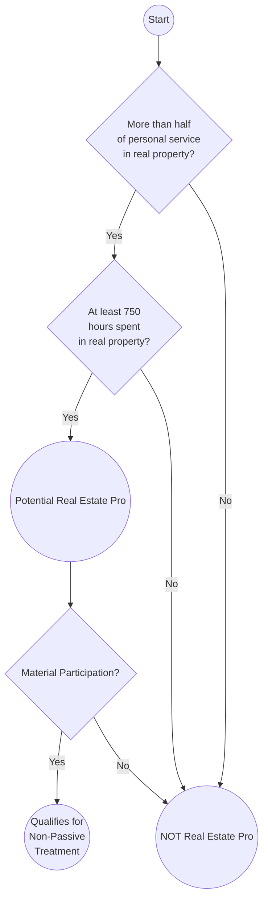
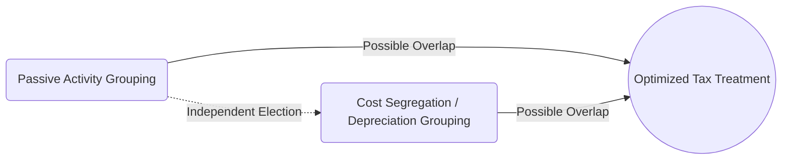

## 24.3 Real Estate Professionals & Tax Complexities

Real estate occupies a unique space in the U.S. tax code, offering an array of opportunities and complexities that practitioners must navigate carefully. From escaping passive activity classification to leveraging grouping elections for depreciation and material participation, understanding these rules is critical for CPA candidates and practicing professionals alike. This section explores the essential concepts, real-world applications, and best practices associated with real estate professional classification, summed up as “REP rules,” and the tax positions those professionals can legitimately take.

Real estate professionals (REPs) often benefit from treating certain real estate activities as non-passive—particularly for deducting losses—and also from strategic grouping elections that can potentially maximize deductions, reduce taxable income, and optimize overall tax planning. We will address thresholds for REP status, discuss how to manage multiple properties or multiple real estate-related trades or businesses, and illustrate residential and commercial property scenarios with concrete examples.

### Overview and Key Definitions

Before delving into strategies and detailed regulations, it is essential to understand a few key definitions that shape tax treatment for real estate professionals:

• Passive Activity: Under Internal Revenue Code (IRC) §469, a passive activity generally includes any trade or business in which the taxpayer does not materially participate. Rental real estate activities are typically categorized as passive unless an exception applies—most notably, qualification as a real estate professional and a showing of material participation.

• Material Participation: The prerequisite to escaping passive classification for individuals or entities demonstrating active and continuous involvement in an activity. Specific tests (i.e., the seven tests under Treasury Regulations §1.469-5T) measure intangible factors such as the number of hours spent, decision-making power, and the nature of management participation.

• Real Estate Professional (REP): A status conferred when a taxpayer meets certain IRS tests for personal services performed in “real property trades or businesses.” Achieving REP status allows rental real estate activities in which the taxpayer materially participates to be classified as non-passive, enabling certain otherwise-limited deductions to offset active or portfolio income.

### Requirements to Qualify as a Real Estate Professional

Qualifying as a real estate professional primarily rests on fulfilling two main criteria under IRC §469(c)(7):

1. More Than Half of Personal Services in Real Estate  
   The taxpayer must perform more than half of his or her personal service hours in real property trades or businesses. Examples include real estate development, property management, real estate brokerage, leasing, and related activities.

2. At Least 750 Hours in Real Estate  
   The taxpayer must perform at least 750 hours of services during the tax year in real property trades or businesses in which he or she materially participates.

For instance, if a CPA (who also owns multiple rental properties) spends 1,600 total working hours annually, of which 900 are devoted to real estate management, sales, or development activities, the threshold for REP status (greater than half of total work hours and a minimum of 750 hours) is satisfied.

However, meeting these tests alone is not enough. Once the taxpayer is deemed a real estate professional, each rental property must then demonstrate material participation to escape passive treatment. Taxpayers may group multiple rental real estate interests as a single activity—an election that can be extremely beneficial, as we will explore below.

Below is a simplified flowchart illustrating the high-level decision-making process for real estate professional status:

### Material Participation Tests

Real estate professionals must satisfy material participation tests for each rental property (or group of properties, if making a grouping election) to avoid passive classification. Although there are seven material participation tests, the most commonly used ones are:

• Participating more than 500 hours in the activity during the year.  
• Participation constituting substantially all of the participation in the activity by all individuals (including non-owners).  
• Participating more than 100 hours during the tax year, and not less than the participation of any other individual.  
• Or a combination of facts and circumstances that demonstrate regular, continuous, and substantial involvement.

For professional landlords or developers, tracking hours and maintaining contemporaneous logs becomes paramount. Detailed timesheets or daily records can be used to demonstrate active involvement, a crucial piece of evidence in an IRS examination.

### Escaping Passive Classification Through Grouping Elections

One of the biggest challenges real estate investors face is meeting the material participation requirement across multiple properties. In many cases, the investor may manage six or seven different rental properties, each of which must individually meet material participation requirements to avoid passive classification unless the taxpayer elects to group them.

Under Treasury Regulations §1.469-9(g), a taxpayer can elect to treat all rental real estate activities as a single activity if the taxpayer qualifies as a real estate professional. Grouping has several key advantages:

• Allows the aggregated properties to meet material participation requirements together rather than individually.  
• Reduces the administrative burden of proving material participation hours for each property.  
• Potentially converts what would have been passive losses into non-passive, offsetting active or portfolio income.

Despite the benefits, there can be risks. Once a grouping election is made, it is generally binding for current and future tax years unless there is a material change in the facts and circumstances. Consequently, if one property is later sold or otherwise removed from the group, the ungrouping process can be complicated. Careful planning is essential to ensure an optimal grouping election.

Example Scenario:  
Sarah owns five rental properties in different parts of her city. She is heavily involved in each property’s management, repairs coordination, and tenant vetting. While she might only spend 100 hours on each property individually, when combined, her total real estate hours exceed 750, and more than half of her working hours are devoted to real estate. If she elects to group these five properties as one activity, she can more easily prove material participation overall, converting the entire operation’s losses from passive to non-passive.

### Depreciation Grouping Strategies

In addition to grouping rental real estate activities for meeting the material participation requirement, another critical aspect is effectively grouping properties for depreciation schedules. Strategically applying different cost recovery methods—and in some cases, combining or segregating assets—can significantly impact the timing and magnitude of tax deductions.

• Cost Segregation Studies: Real estate professionals can leverage cost segregation to break down the components of a building into different asset classes, accelerating depreciation deductions (e.g., 5-year, 15-year property for certain fixtures and land improvements).  

• Grouping for Cost Recovery: Grouping multiple real estate ventures for depreciation can streamline recordkeeping, but practitioners should weigh the implications on potentially disposing of one property without disposing of all.  

• Bonus Depreciation & Section 179: While traditionally used for tangible personal property, real estate professionals should stay updated on current legislative changes that might extend or limit the availability of bonus depreciation and Section 179 on qualified improvements.  

• Consistent Treatment: The grouping decisions for the passive activity rules do not necessarily have to be the same as those for depreciation, but consistent treatment can help reduce IRS scrutiny and ensure clarity.  

The main goal is to cultivate tax efficiency while keeping adequate records to defend any positions taken. Taxpayers and their CPAs must clarify whether to group or segregate for the passive loss rules, as well as how to potentially group or segregate for depreciation and cost segregation purposes. In some cases, a property might be grouped for passive activity rules but remain distinct for cost segregation.  

Below is a simple diagram illustrating the interplay between grouping for passive loss rules and grouping for depreciation (Cost Segregation). The thick arrow indicates that these can operate independently, yet they often intersect in real-world planning:

In practice, each election depends on a detailed review of the taxpayer’s overall objectives, property types, and future plans, such as anticipated dispositions or expansions.

### Special Considerations: Short-Term Rentals & Self-Rental

While most rental real estate is presumed passive under the law, short-term rentals (e.g., vacation rentals, Airbnb-type properties) may not automatically be treated as passive if they do not constitute a “rental activity” under §469 rules. For instance, if the average guest stay is seven days or less, it may be treated as non-rental (potentially requiring demonstration of material participation in a different way).

Self-rental activities, where the taxpayer rents property to their business, also have unique rules. Typically, rental income from a property leased to a business in which the taxpayer materially participates is automatically recharacterized as non-passive. However, if the taxpayer does not meet the real estate professional requirements and does not materially participate, complex classification issues can arise.

Real estate professionals with short-term rentals who also actively manage those properties have strong non-passive arguments, as they are often providing substantial services—cleaning, changing linens, offering breakfast, or other hospitality—in addition to typical landlord duties.

### Common Pitfalls and Best Practices

• Poor Recordkeeping: The IRS often scrutinizes REP claims. Maintaining logs detailing hours spent, tasks performed, and involvement in decision-making is essential. Failing to substantiate hours is a frequent cause of disallowance.

• Overlooking Material Participation in Each Activity: Merely qualifying as a real estate professional does not automatically eliminate passive classification for every rental property. Each property (or grouped set of properties) must meet one of the seven material participation tests.

• Improper or Untimely Grouping Election: Many taxpayers forget to make a clear election in their tax returns. This may result in a missed opportunity to aggregate hour totals, leading to partial or total disallowance of losses.

• Failing to Re-Evaluate Grouping Post-Transaction: Significant changes—like selling a property, adding a new development, or changing management structure—might necessitate a reevaluation of the grouping strategy.

• Bonus Depreciation Phaseouts: Keep track of changes in bonus depreciation percentages year over year, as they can significantly affect your overall deductions.

• Inadvertent Self-Rental Traps: Renting from your own S corporation or partnership can trigger recharacterization rules under IRC §469, so verify correct classification to avoid unwelcome surprises.

Despite these challenges, proper planning and a thorough understanding of the rules enable real estate businesses and investors to maximize legitimate tax benefits.

### Case Studies & Practical Applications

Case Study 1: The Start-Up Developer  
Dennis, a new real estate developer, works full-time on building small multifamily units. He logs 1,200 hours in 2024 on site visits, negotiating with contractors, sourcing materials, and marketing. Dennis has part-time bookkeeping work for other clients (300 hours). Because he devotes more than half of his total hours (1,200 out of 1,500) to real estate and exceeds the 750-hour threshold, Dennis qualifies as a real estate professional. Provided he documents these hours reliably and can demonstrate material participation in each development or aggregated grouping, Dennis caters for non-passive treatment of potential rental losses once the multifamily units come online.

Case Study 2: The Seasoned Investor with Multiple Rentals  
Beth owns 12 rental homes across two states. Individually, each property logs about 60 hours of management time from Beth, who coordinates tenant relations, minor repairs, and rent collection. She has few other professional interests (less than 300 hours annually). By filing a grouping election on her tax return, Beth can combine the hours spent across all her rental activities, pushing her total real estate hours above 750. Her main challenge is ensuring that the aggregated hours surpass the hours she spends in any other trade or business, thus meeting the real estate professional criteria.

Case Study 3: Cost Segregation Win  
Sharon invests in a four-story commercial building. As a real estate professional, she hires an engineer-led cost segregation team, who identifies numerous components eligible for shorter depreciable lives (e.g., five-year for carpets, seven-year for fixtures, fifteen-year for parking structures). While she groups all her real estate activities for passive activity purposes, she strategically separates key components for faster depreciation. This approach dramatically accelerates her deductions in the early years, freeing up cash flow for expansion. However, she must manage the recapture risk if she sells components earlier than expected and remain consistent with documentation in case of audit.

In each case, thorough documentation of hours, adherence to grouping rules, and knowledge of advanced depreciation strategies are central to the taxpayer’s success in taking advantage of real estate professional status.

### References and Additional Resources

• Internal Revenue Code §469.  
• Treasury Regulations §1.469-5T and §1.469-9.  
• IRS Publication 925 (Passive Activity and At-Risk Rules).  
• AICPA Publications and Webinars on Real Estate Tax Strategies.  
• Professional guidance on cost segregation studies and advanced depreciation.  

These resources provide detailed regulations, official explanations, and guidance to further explore real estate professional qualification, material participation tests, and grouping elections. CPA candidates, in particular, are encouraged to engage with updated code sections and relevant authorities, as exam content assumes familiarity with the real-world application of these statutes.

## Real Estate Professional Status & Grouping Mastery Quiz



### Which of the following is a key requirement to qualify as a real estate professional under IRC §469(c)(7)?  
- [x] Spending more than half of one’s personal service hours in real property trades or businesses  
- [ ] Generating at least $100,000 in gross rental income  
- [ ] Owning more than three rental properties  
- [ ] Employing at least one part-time assistant  

> **Explanation:** Real estate professionals must spend over half of their personal service hours, and at least 750 hours, in real property trades or businesses.  

### Which of the following statements about material participation is TRUE?  
- [ ] It is automatically satisfied for all real estate professionals  
- [x] Each property (or a grouped set of properties) must meet a material participation test  
- [ ] It requires a minimum of 5,000 hours annually  
- [ ] It is only relevant for real estate developers, not investors  

> **Explanation:** Even after qualifying as a real estate professional, you must prove material participation for each property or grouped activity to escape passive classification.  

### How does grouping multiple rental properties under the regulations help a real estate professional?  
- [ ] It removes the need for any hours testing  
- [ ] It allows indefinite deferral of capital gains  
- [x] It aggregates hours for material participation, making it easier to meet participation requirements  
- [ ] It automatically reduces any recapture liability on disposition  

> **Explanation:** Grouping rental properties allows the taxpayer to combine hours and activities, which can help them meet the material participation tests as a single activity.  

### Which of the following short-term rental factors may lead to non-passive treatment?  
- [x] Average guest stays of seven days or less, with significant services provided  
- [ ] Properties located in different states  
- [ ] Properties managed by a third-party service  
- [ ] Including utility bills in the tenant’s rent  

> **Explanation:** When the average guest stay is seven days or fewer and the taxpayer provides services akin to a hotel, the rental may be treated as non-passive if material participation is met.  

### What is a primary advantage of cost segregation for real estate professionals?  
- [x] Accelerating depreciation deductions by reclassifying property components  
- [ ] Avoiding the at-risk rules entirely  
- [x] Potentially increasing the annual tax benefit and boosting cash flow  
- [ ] Eliminating the need to file IRS Form 4562  

> **Explanation:** Cost segregation identifies property components for shorter depreciable lives, accelerating deductions and improving annual cash flow—two major advantages for real estate professionals.  

### Which best describes the risk of making a grouping election improperly?  
- [x] The election, once made, can be difficult or impossible to revoke without a material change  
- [ ] The election can only be made if taxpayer owns more than 20 rental units  
- [ ] The election must be renewed every two years  
- [ ] The election guarantees non-passive treatment even if no material participation exists  

> **Explanation:** Grouping is generally permanent unless there is a material change. Taxpayers should proceed carefully.  

### A real estate professional can treat rental real estate losses as non-passive only if:  
- [x] The taxpayer meets both the real estate professional tests and material participation tests  
- [ ] The taxpayer invests more than $500,000 in the property  
- [x] The rental is located outside of the taxpayer’s home state  
- [ ] The rental unit has more than five tenants  

> **Explanation:** Losses are treated as non-passive if and only if the taxpayer is a real estate professional and materially participates in the rental activity.  

### Under the real estate professional rules, which of the following hours would count toward the 750-hour threshold?  
- [x] Time spent finding tenants, performing repairs, and scheduling contractors  
- [ ] Hours spent learning about real estate theory in an online course  
- [ ] Commuting time from home to the rental property  
- [ ] Logging phone calls made on unrelated business matters  

> **Explanation:** Only hours spent directly managing, maintaining, or otherwise operating the real estate activity count toward REP hours. Educational or purely commuting hours usually do not qualify.  

### Which of the following actions might attract heightened IRS scrutiny for a real estate professional?  
- [x] Claiming high rental property losses for many years with no evidence of hours logs  
- [ ] Paying state-level property taxes on time  
- [ ] Filing an timely extension for business taxes  
- [ ] Hiring a reputable property management company for an out-of-state property  

> **Explanation:** Large losses over multiple years without adequate substantiation (hour logs, time sheets, etc.) may appear suspicious and prompt IRS scrutiny.  

### Qualifying as a real estate professional automatically makes all rental losses non-passive.  
- [x] True  
- [ ] False  

> **Explanation:** Strictly speaking, this is True only if the taxpayer also meets material participation requirements for each real estate activity. However, once a taxpayer legitimately meets the appropriates tests (REP + material participation), the losses are typically no longer passive. Note that without material participation, losses remain passive.



---

## For Additional Practice and Deeper Preparation

**[TCP CPA Hardest Mock Exams: In-Depth & Clear Explanations](https://www.udemy.com/course/tcp-cpa-mock-exams/?referralCode=675149871D0E79B1699C)**  

**Tax Compliance & Planning (TCP) CPA Mocks:** 6 Full (1,500 Qs), Harder Than Real! In-Depth & Clear. Crush With Confidence!

- Tackle full-length mock exams designed to mirror real TCP questions.  
- Refine your exam-day strategies with detailed, step-by-step solutions for every scenario.  
- Explore in-depth rationales that reinforce higher-level concepts, giving you an edge on test day.  
- Boost confidence and minimize anxiety by mastering every corner of the TCP blueprint.  
- Perfect for those seeking exceptionally hard mocks and real-world readiness.  

_Disclaimer: This course is not endorsed by or affiliated with the AICPA, NASBA, or any official CPA Examination authority. All content is for educational and preparatory purposes only._
