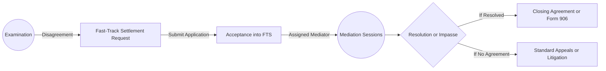
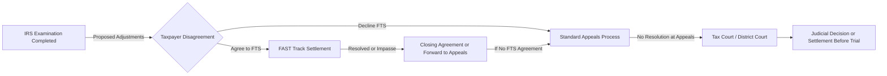

## 25.1 FAST Track Settlement, Appeals & Mediation Methods

In the realm of federal tax controversies, a protracted and adversarial dispute with the Internal Revenue Service (IRS) is rarely beneficial for either party. Fortunately, there are alternative dispute resolution (ADR) tools available to streamline the process, reduce time, and cut down the cost of such disputes. One of the most notable programs is FAST Track Settlement, which, as part of the broader IRS Appeals and Mediation ecosystem, aims to help taxpayers and the IRS reach mutually acceptable resolutions quickly. 

This section provides an in-depth look at:

• An overview of IRS ADR programs and their role in tax controversies  
• The FAST Track Settlement program, its advantages, timelines, and success rates  
• The mediation and appeals landscape at the IRS  
• Practical examples, best practices, and potential pitfalls  
• Additional references for deeper exploration  

Understanding these methods is especially valuable for CPA candidates preparing for the Tax Compliance and Planning (TCP) section of the Uniform CPA Examination. Mastery of topics like dispute resolution strategies and procedural practice can offer tremendous value when advising clients or making strategic decisions in real-world tax settings.

---

### The Role of Alternative Dispute Resolution in IRS Controversies

After the IRS completes an examination (audit) of a taxpayer’s returns, disagreements about proposed assessments or adjustments may arise. Traditionally, taxpayers might appeal these findings through the IRS Office of Appeals or proceed to court if no resolution is reached. However, litigation can be expensive, time-consuming, and uncertain. ADR techniques, including mediation, arbitration, and FAST Track Settlement, were introduced to expedite resolution by allowing both the taxpayer and the IRS to discuss disputed issues in a less adversarial environment.

#### Why ADR?

1. Reduced Costs: Litigation can be costly. ADR aims to minimize both the IRS’s and the taxpayer’s legal fees and administrative burdens.  
2. Faster Resolution: ADR methods often conclude within weeks or months, whereas court battles can last years.  
3. Preservation of Relationships: The ADR process encourages collaboration and constructive communication between taxpayers and the IRS, reducing hostility and maintaining professional relationships.  
4. Flexibility: Dispute resolution methods can be tailored to the specific facts of each case, yielding creative solutions unattainable through litigation alone.  

---

### IRS Appeals: A Brief Overview

While FAST Track Settlement is one of the central programs this chapter will discuss, it is helpful to situate it within the broader context of the IRS appeals system. The IRS Office of Appeals operates independently of the other branches of the IRS, offering a venue for impartial review of tax disputes. Appeals Officers weigh the strengths and weaknesses of each side’s arguments and attempt to negotiate settlements based on facts, law, and hazards of litigation. 

Common steps in a tax dispute:

1. Examination: The IRS audits the taxpayer’s returns. If the taxpayer disagrees with the proposed adjustments, they can provide additional evidence or negotiate adjustments.  
2. Thirty-Day Letter: If an agreement can’t be reached with the examination team, they issue a “30-day letter” to the taxpayer, granting the right to appeal the proposed changes.  
3. Appeals Conference: The taxpayer submits a written protest and then meets with an IRS Appeals Officer.  
4. Ninety-Day Letter: If the dispute remains unresolved after the appeal opportunity, the IRS issues a statutory notice of deficiency (“90-day letter”), after which the taxpayer can petition the Tax Court.

At any point, or even before reaching a formal appeals process, the taxpayer and the IRS might consider alternative dispute resolution.

---

### FAST Track Settlement (FTS): A Closer Look

FAST Track Settlement (FTS) is designed to expedite the resolution of tax controversies during the examination process, without waiting for the case to enter the standard appeals pipeline. Depending on the taxpayer’s size and type (Large Business & International (LB&I) or Small Business/Self-Employed (SB/SE)), there are specific versions of FAST Track programs.  

1. LB&I FAST Track Settlement: Primarily for large corporate taxpayers with complex issues under audit.  
2. SB/SE FAST Track Settlement: Tailored for small businesses and individuals with relatively simpler but still disputed issues.  

#### Objectives

• Expedite resolutions of factual and legal disputes at the examination stage  
• Avoid the time and resource consumption of full-blown appeals or litigation  
• Provide a trained mediator (usually an Appeals Officer) who acts as an impartial facilitator  

#### Eligibility Criteria

FAST Track Settlement is available in most cases where:

• The taxpayer has an ongoing examination with the IRS.  
• There are factual or legal disputes that can be resolved via negotiation.  
• Both the IRS examiner and taxpayer are willing to participate fully.  

However, FTS is generally unavailable for issues designated for litigation, issues without a clear legal or factual basis, or cases that have already been referred to the Department of Justice.  

---

### FAST Track Settlement Process Flow

Below is a high-level overview of the FAST Track Settlement process, showing key points of taxpayer and examiner interaction. Once both parties agree to attempt FTS, an Appeals mediator becomes involved to facilitate discussions.

1. Disagreement at Examination: The examiner and taxpayer disagree on specific items.  
2. FTS Request: The taxpayer and examiner jointly request to enter the FAST Track program.  
3. Acceptance: Appeals evaluates the application and accepts eligible cases.  
4. Mediation Sessions: An appeals mediator guides the discussions, identifying potential settlement areas.  
5. Resolution or Impasse: If resolved, a closing agreement (e.g., Form 906) is executed. If not, the taxpayer may still proceed to the traditional Appeals or litigation route.  

---

### Timelines and Success Rates

Because one of the goals of FAST Track Settlement is efficiency, the program is designed to resolve disputes in approximately 60 days (for LB&I) or sometimes in as few as 40 days (for SB/SE). Actual timeframes can vary based on issue complexity, taxpayer responsiveness, and the availability of resources.  

Success rates tend to be favorable:

• In LB&I FAST Track Settlement, the IRS has historically reported resolution rates of around 80-85%, with many cases closing within 100 days.  
• In the SB/SE environment, reported success rates are also high. Many smaller cases with less complex issues can be resolved in under two months.  

These statistics make FAST Track an attractive option for taxpayers who need a quicker resolution and are open to negotiated settlements.

---

### FAST Track Mediation

FAST Track Mediation (FTM) is sometimes conflated with FAST Track Settlement. Although both involve a trained mediator, FTM can be employed at different stages and has a narrower scope. Unlike FTS, which includes a settlement component, FTM is purely about mediating to see if both sides can reach an agreement. The mediator does not have settlement authority but helps bridge factual gaps, clarify positions, and promote an environment where compromise is more likely.

Key distinctions:

• FTM may be used for smaller controversies or even collection issues.  
• The mediator strictly facilitates; no direct settlement authority is granted to the mediator.  
• Timelines vary but are generally shorter than going through standard appeals.  

---

### Appeals Mediation and Post-Appeals Mediation (PAM)

Beyond FAST Track, the IRS also offers mediation programs at the Appeals stage. Post-Appeals Mediation (PAM) is typically available if a taxpayer’s case is already under the jurisdiction of Appeals, and both parties can’t settle the dispute but agree to attempt an alternative approach. In PAM:

• An appeals mediator who wasn’t involved in the original appeals conference helps facilitate communication.  
• The mediator aims to clarify the “gray areas” of dispute.  
• If successful, the case is closed with a mutual settlement. Otherwise, it can move to Tax Court or District Court litigation.

While distinct from FAST Track Settlement, Post-Appeals Mediation has similar aims—reducing the resources spent and fostering early resolution. For TCP exam preparation, it’s important to note these parallel avenues.

---

### Best Practices for FAST Track Settlement

1. Early Involvement: Identify potential disputes during the audit process, and consider FAST Track before positions harden.  
2. Clear Documentation: Organize tax returns, workpapers, and relevant evidence to present a solid, cohesive argument.  
3. Engage Proactively: Communicate openly with the IRS examiner. If both parties demonstrate willingness to settle, the mediator’s job becomes smoother.  
4. Consult Specialists: Complex issues (transfer pricing, R&D credits, etc.) often benefit from expert support, such as attorneys or specialized CPAs, to clarify technical points.  
5. Identify Non-Negotiables: Each side should identify which issues are deal-breakers and where they might concede.  

---

### Common Pitfalls and How to Avoid Them

• Inadequate Preparation: Presenting incomplete data causes delays. Thorough preparation, including reviewing relevant sections of the Internal Revenue Code (IRC) and Treasury Regulations, is crucial.  
• Unrealistic Expectations: Entering the process with rigid demands may lead to quick impasse. Maintain open-mindedness—each side must be prepared to compromise.  
• Delayed Application: Waiting until the end of the examination to request FAST Track can limit the program’s benefits. Engaging ADR early fosters a more efficient resolution.  
• Lack of Representation: Taxpayers often benefit from professional representation, especially when dealing with complex corporate or partnership structures.  

---

### Practical Case Study

Imagine a mid-sized manufacturing corporation experiencing an ongoing IRS examination. The company disputes a large inventory valuation adjustment that could significantly increase its taxable income. Both the taxpayer and the IRS examiner want to avoid long, costly litigation. They decide to seek FAST Track Settlement. 

1. Submission and Acceptance: After discussing the proposed adjustment, the taxpayer and the examiner jointly apply for FAST Track Settlement. Within two weeks, Appeals accepts the request.  
2. Mediator’s Role: A trained Appeals mediator convenes multiple sessions. During these sessions, the company’s accounting team provides detailed evidence of their valuation methodology, while the IRS examiner clarifies specific points of contention.  
3. Agreement Reached: Ultimately, both parties agree on a modified adjustment, reducing the original IRS proposed increase by 25%. They document the settlement on Form 906.  
4. Timeline: From application to signed settlement, it takes 65 days—far shorter than an additional year or more that a standard appeals route could have taken.  

Companies and individual taxpayers similarly benefit from such processes, especially if they maintain proper documentation and approach the negotiation in a spirit of cooperation.

---

### Diagram: Appeals vs. FAST Track Settlement Pathway

The following diagram offers a more comprehensive perspective on how FAST Track Settlement fits within the broader dispute resolution continuum.

---

### Strategic Considerations for CPA Candidates

For CPA candidates focused on the Tax Compliance and Planning (TCP) exam, understanding these resolution pathways is vital:

• Exam Application: Test questions can center on identifying which issues are suitable for FAST Track Settlement or Mediation.  
• Real-World Application: As future CPAs, you may advise clients on whether to use these programs.  
• Ethical Implications: CPAs must ensure honest disclosure and fair dealing during the mediation or settlement process (see Chapter 21: Practice & Procedure on ethics standards).  

In addition to memorizing procedures, aim to grasp the underlying policy rationale: the IRS wants to resolve valid disputes efficiently and fairly, while protecting the U.S. Treasury’s interests.

---

### References for Further Exploration

• IRS Publication 3605: Provides guidance on the FAST Track Settlement program.  
• Internal Revenue Manual (IRM), Part 8 (Appeals): Detailed procedures on appeals and mediation.  
• “Tax Controversies: Practice and Procedure” by David M. Fogel et al.: A robust reference for advanced dispute resolution strategies.  
• The AICPA Tax Section website for the latest legislative and administrative guidance on ADR.  

---

### Conclusion

Given the inherent complexity of federal tax disputes, the FAST Track Settlement and other appeals and mediation methods offer a pragmatic route for both taxpayers and the IRS to achieve cost-effective and timely resolutions. As you prepare for the Uniform CPA Examination, building a thorough understanding of these programs not only helps you answer exam questions but also equips you with valuable knowledge for future client advocacy and tax planning. Remember that success in these programs ultimately rests on comprehensive preparation, open communication, and the willingness to find common ground.

---

## Test Your Knowledge: IRS Dispute Resolution & FAST Track Settlement Quiz



### In which stage of the IRS audit process is FAST Track Settlement typically initiated?

- [ ] After the taxpayer receives a statutory notice of deficiency 
- [x] During the examination, before finalizing proposed adjustments 
- [ ] Only after the taxpayer files a petition in Tax Court 
- [ ] Only following a failed Appeals conference 

> **Explanation:** FAST Track Settlement is intended to speed up resolution while the case is still in the examination phase, reducing the need for a full-blown appeals process.

### Which of the following is a key advantage of using ADR methods like FAST Track Settlement?

- [ ] They always result in no tax liability.  
- [ ] They must be approved by the Tax Court.  
- [x] They often lead to faster resolution and lower costs.  
- [ ] They require the taxpayer to plead guilty to a tax offense.  

> **Explanation:** ADR methods can significantly reduce the time and expense of resolving disputes compared to protracted litigation or traditional appeals.

### What is the typical timeframe for resolving SB/SE cases through FAST Track Settlement?

- [ ] Four to five years  
- [ ] Approximately 12–18 months  
- [ ] Less than one week in most instances  
- [x] Around 40–60 days  

> **Explanation:** Small Business/Self-Employed (SB/SE) cases often require fewer complex steps and can be resolved more quickly, typically within 40–60 days.

### In Post-Appeals Mediation (PAM), who generally serves as the mediator?

- [ ] The taxpayer’s CPA  
- [ ] The original Revenue Agent who audited the return  
- [ ] A Tax Court judge  
- [x] An Appeals Officer independent of the initial Appeals conference  

> **Explanation:** An independent Appeals Officer, not previously involved in the case, is assigned to mediate the dispute during PAM.

### Which of the following is NOT a common pitfall in the FAST Track Settlement process?

- [ ] Inadequate preparation and incomplete data  
- [x] Overcommunication and excessive disclosure  
- [ ] Unrealistic settlement expectations  
- [ ] Delayed application for FAST Track Settlement  

> **Explanation:** While incomplete data, unrealistic expectations, and delayed application are pitfalls, overcommunication is rarely a major problem; transparency and clarity often help facilitate a successful resolution.

### Which formal document usually memorializes an agreement reached during FAST Track Settlement?

- [ ] Tax Court Petition (Form 2)  
- [ ] Notice of Deficiency (90-day letter)  
- [x] Closing Agreement (e.g., Form 906)  
- [ ] Form 1040X  

> **Explanation:** A Closing Agreement such as Form 906 typically finalizes the settlement terms agreed upon by the taxpayer and the IRS.

### Which of the following best describes the role of the mediator in FAST Track Mediation?

- [ ] The mediator imposes binding decisions.  
- [ ] The mediator represents the taxpayer.  
- [x] The mediator facilitates negotiation without having settlement authority.  
- [ ] The mediator automatically sides with the IRS for legal authority.  

> **Explanation:** In FAST Track Mediation, the mediator is neutral and has no power to impose a binding resolution. They simply assist in communication and negotiations.

### What is one major difference between LB&I FAST Track Settlement and SB/SE FAST Track Settlement?

- [ ] SB/SE cases cannot use a mediator.  
- [x] LB&I typically deals with larger, more complex cases.  
- [ ] LB&I is mandatory; SB/SE is voluntary.  
- [ ] SB/SE only covers partnership returns.  

> **Explanation:** LB&I FAST Track Settlement is generally geared toward larger corporations with more complex tax issues, whereas SB/SE aims at smaller issues and individual taxpayers.

### Which factor typically increases the likelihood of a successful settlement in FAST Track Settlement?

- [x] Both taxpayer and examiner are open to compromise.  
- [ ] The taxpayer refuses to disclose any information.  
- [ ] The IRS examiner insists no negotiation is needed.  
- [ ] The taxpayer preemptively files a Tax Court petition.  

> **Explanation:** FAST Track Settlement hinges on the willingness of both parties to communicate and seek a middle ground. Without an openness to compromise, reaching a settlement is greatly hindered.

### The mediator in a FAST Track Settlement program can best be described as:

- [x] Neutral but employed by the IRS Appeals Office.  
- [ ] Hired by the taxpayer’s representative.  
- [ ] Always an external third-party arbitrator.  
- [ ] Acting as legal counsel for the IRS.  

> **Explanation:** The mediator is typically an experienced Appeals Officer, independent of the examination function, who facilitates discussion and resolution without acting as legal counsel for either side.



---

## For Additional Practice and Deeper Preparation

**[TCP CPA Hardest Mock Exams: In-Depth & Clear Explanations](https://www.udemy.com/course/tcp-cpa-mock-exams/?referralCode=675149871D0E79B1699C)**  

**Tax Compliance & Planning (TCP) CPA Mocks:** 6 Full (1,500 Qs), Harder Than Real! In-Depth & Clear. Crush With Confidence!  

- Tackle full-length mock exams designed to mirror real TCP questions.  
- Refine your exam-day strategies with detailed, step-by-step solutions for every scenario.  
- Explore in-depth rationales that reinforce higher-level concepts, giving you an edge on test day.  
- Boost confidence and minimize anxiety by mastering every corner of the TCP blueprint.  
- Perfect for those seeking exceptionally hard mocks and real-world readiness.  

_Disclaimer: This course is not endorsed by or affiliated with the AICPA, NASBA, or any official CPA Examination authority. All content is for educational and preparatory purposes only._
