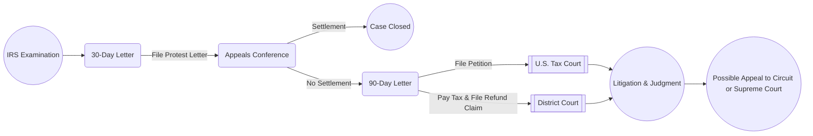

## 25.2 Formal Protest Letters & Litigation Tactics

Effective communication and strategic decision-making are paramount when taxpayers disagree with Internal Revenue Service (IRS) determinations. In the broader context of CPA practice and exam preparedness, understanding how to draft a Formal Protest Letter and evaluate litigation pathways can significantly impact both client outcomes and one’s performance on the Tax Compliance and Planning (TCP) section of the Uniform CPA Exam. This article explores essential elements of a Formal Protest Letter, highlights strategic considerations for litigation in the U.S. Tax Court versus federal district courts, and includes practical examples and insights from real-world cases.

Throughout this chapter, you will find references to other relevant chapters in this textbook, including Chapter 21: Practice & Procedure, which covers examinations and appeals processes, as well as Section 25.1: FAST Track Settlement, Appeals & Mediation Methods. These adjacent sections help contextualize your study of formal protest and litigation tactics within the broader practice of dispute resolution.

Effective mastery of protest letters and litigation tactics is critical not only for the CPA exam but also for any future professional seeking to help clients resolve tax controversies. Much of what you learn here applies to entity and individual disputes alike (refer to Chapters 3 through 12 for entity- and individual-level tax rules), ensuring you can adapt these tactics to varied contexts.

---

Introduction to the Protest Process

When the IRS proposes adjustments to a taxpayer’s return, particularly after an examination (or “audit”), they typically issue a “30-day letter” that outlines the IRS’s proposed assessment and explains the taxpayer’s right to appeal. One of the first crucial steps in this formal appeals process is submitting a Formal Protest Letter to request a conference with the Office of Appeals.

A thoughtful, well-structured Protest Letter lays the foundation for the entire appellate review. It helps establish the taxpayer’s position by:

• Clearly stating the issues in dispute.  
• Demonstrating the legal and factual basis to challenge the IRS’s proposed adjustments.  
• Providing supporting evidence and citations to relevant authorities such as the Internal Revenue Code (IRC), related Treasury Regulations, revenue rulings, and case law (refer to Chapter 2 for more on sources of primary authority).

Below is a step-by-step analysis of key components in drafting a Formal Protest Letter, followed by a partial sample structure.

---

Key Elements of a Formal Protest Letter

Clear Identification of Taxpayer and Tax Years  
The letter should begin with basic identification details: the taxpayer’s name, address, identification number (e.g., Social Security Number, Employer Identification Number), and the specific years or tax periods under examination.

Statement of Taxpayer’s Intent to Appeal  
Within the opening paragraphs, the taxpayer should expressly indicate their wish to appeal. This notification clarifies that the taxpayer seeks to enter the official appeals process rather than ignore the IRS’s notice or simply file for another procedure.

Detailed Description of Each Disputed Issue  
Each point of contention should be separated into sub-sections, allowing the reader (particularly the Appeals Officer) to understand precisely which aspects of the IRS’s position the taxpayer contests. For instance, if the IRS disallowed certain deductions, identify each deduction separately, accompanied by references to any relevant statutory language or regulation.

Legal Argument and Factual Narrative  
For each issue in dispute, provide both a legal and factual basis. Cite relevant sections of the IRC, Treasury Regulations, and pertinent court cases. Illustrate how the taxpayer’s actions comply with or can be reconciled to those interpretations. From a factual standpoint, present supporting documentation (e.g., receipts, contracts, and any third-party verifications).

Request for Relief or Clarification  
Be explicit about the specific relief sought. If the taxpayer believes that certain adjustments are unwarranted, request a correction or complete removal of those adjustments. Where necessary, request partial adjustments or clarification of IRS positions that appear vague or ambiguous.

Taxpayer’s Signature and Declaration  
End with a signed declaration, stating under penalty of perjury that the facts contained within the Protest Letter are true and accurate to the best of the taxpayer’s knowledge.

---

Partial Sample Protest Letter Structure

Below is a simplified, partial structure illustrating how a Formal Protest Letter might be organized. This example is for educational purposes and should be adapted to the client’s specific facts and issues.

----------------------------
[Taxpayer’s Name]  
[Address]  
[City, State ZIP]  
[Date]

Internal Revenue Service  
[Office of Appeals]  
[Address]  
[City, State ZIP]

RE: Formal Protest of Proposed Tax Adjustments for Tax Years [____]

Dear [Name of Appeals Officer or “To Whom It May Concern”]:

I am writing to formally protest the proposed adjustments to my [Form 1040/1120/etc.] for tax years [____], as outlined in the [Date of 30-Day Letter] notice (Letter [XXXX]) I received from the IRS. I respectfully request an Appeals conference to discuss and resolve the following issues:

1) Adjustment of [Describe Specific Issue]  
   a) Factual Background and Summary  
   b) Legal Analysis (cite IRC §§, Regs, Cases)  
   c) Conclusion and Requested Relief  

2) Adjustment of [Describe Additional Issue]  
   a) Factual Background and Summary  
   b) Legal Analysis (cite IRC §§, Regs, Cases)  
   c) Conclusion and Requested Relief  

Conclusion  
Based on the foregoing evidence and authorities, I disagree with the IRS’s proposed adjustments. I request that the Appeals Office withdraw or modify the assessment per the detailed arguments above.

Under penalties of perjury, I declare that I have examined the facts stated in this letter (and any accompanying statements or attachments), and to the best of my knowledge and belief, they are true, correct, and complete.

Sincerely,  
[Taxpayer Name / Authorized Representative]  
----------------------------

In practice, the Protest Letter will likely include additional attachments, documentary evidence, and potentially memoranda of law. It is often wise to consult an attorney or CPA skilled in tax controversy to ensure the letter meets the technical and procedural requirements of the IRS.

---

Navigating the Appeals Process and the Road to Litigation

After submitting a Formal Protest Letter, the taxpayer typically has an opportunity to resolve the issues administratively with the Appeals Office. IRS Appeals exists to settle tax controversies without expensive and time-consuming litigation, although sometimes a compromise cannot be reached (see Section 25.1 on FAST Track Settlement, Appeals & Mediation Methods).

If a settlement is not reached, or if the taxpayer receives a “Notice of Deficiency” (often referred to as a “90-day letter”), the next phase is to determine whether to pursue litigation. Taxpayers generally have multiple forums in which to litigate a tax dispute, with the U.S. Tax Court, District Court, and the Court of Federal Claims being the primary venues. Deciding which court to approach depends on various factors, including the desire to pay the disputed tax upfront, the nature of the issues involved, and strategic considerations such as available discovery mechanisms and potential jury trials.

---

Differences in U.S. Tax Court and District Court Approaches

One of the most important considerations for CPA candidates and practitioners is understanding the procedural and strategic differences between the U.S. Tax Court and the federal district courts.  

U.S. Tax Court  

• Jurisdiction: Handles disputes over notices of deficiency (90-day letters) and certain other matters without requiring the taxpayer to pay the assessed tax prior to litigation.  
• Judges: Comprised of tax law specialists; bench trial only (no juries).  
• Discovery: Formal discovery exists but is somewhat narrower in scope than in a federal district court.  
• Speed: Often quicker for resolution than district court if the case is relatively routine.  
• Appeals: Hears cases nationwide; appeals typically go to the taxpayer’s circuit court of appeals.  

District Court  

• Jurisdiction: Taxpayer must generally pay the assessed tax first and then file a claim for refund. If the claim is disallowed, they can litigate the matter in District Court.  
• Judges: Generalist federal judges preside; taxpayer may request a jury trial in certain cases.  
• Discovery: Potentially broader discovery rules akin to other federal civil cases.  
• Strategic Use: If the taxpayer believes a jury might be sympathetic, or the issues are particularly fact-heavy (e.g., fraud or negligence cases), District Court can be advantageous.  
• Appeals: Appeals are heard by the local U.S. Court of Appeals for that district’s jurisdiction.  

In some scenarios, taxpayers may choose the Court of Federal Claims, especially if specialized issues related to federal government contracts, refunds, or unusual claims arise. However, most individual and small business disputes end up in either the U.S. Tax Court or District Court.

---

Mermaid Diagram: Paths from IRS Examination to Litigation

Below is a simplified flowchart illustrating the typical path from an initial IRS examination to either settlement or litigation in the U.S. Tax Court or District Court.

In this flow:

• The taxpayer usually starts with the IRS examination, which culminates in a 30-day letter.  
• A Formal Protest Letter leads to a conference with IRS Appeals.  
• If unresolved, a 90-day letter is issued, leading to either Tax Court litigation or a “pay-then-sue” approach in District Court.

---

Litigation Tactics and Best Practices

Whether you ultimately appear before the U.S. Tax Court or a District Court, below are some key strategies:

Early Preparation of Evidence  
A robust record-keeping system and clear factual narrative support your protest. Document everything underlying the disputed items, from invoices and receipts to signed agreements.

Utilizing Experts  
Complex valuation or highly technical accounting issues often necessitate expert witnesses. Their testimony can illustrate more nuanced tax positions, especially in District Court, where a jury may need simplified explanations of complex tax matters.

Settlement Considerations  
Many tax controversies resolve before trial. Negotiating a settlement can significantly reduce time and cost. Appear well-prepared to highlight strengths and weaknesses, as a balanced risk perspective often leads to a more favorable settlement for the taxpayer.

Timing  
The taxpayer’s timeline to file a petition with the Tax Court is critical: 90 days from the issuance of the Notice of Deficiency (or 150 days if addressed to a taxpayer outside the U.S.). Missing this statutory window typically forfeits the chance to litigate in Tax Court.

Appeals  
Decisions from either Tax Court or District Court can be appealed to the relevant U.S. Court of Appeals. Be strategic about preserving issues for appeal by raising them early in the proceedings.

---

Real-World Example

Suppose a high-net-worth individual, Jane Smith, receives a 30-day letter disallowing a significant charitable deduction for a valuable piece of art donated to a museum. If Ms. Smith files a Formal Protest Letter and the Appeals Conference fails to resolve the dispute, Ms. Smith receives a 90-day letter proposing a deficiency. Because Ms. Smith has a strong legal argument and does not want to pay the tax upfront, she opts for U.S. Tax Court. Her counsel emphasizes the qualified appraisal compliance and references relevant case law on charitable contributions (e.g., proven valuations, acknowledgement letters). Ultimately, the Tax Court rules partially in Ms. Smith’s favor, reducing the IRS’s proposed deficiency. While the official outcome depends on fact-specific details, the process from Protest Letter to final Tax Court decision is typical of many disputed valuation cases.

---

Common Pitfalls and How to Avoid Them

• Missing Deadlines: Strict time constraints exist for responding to 30-day and 90-day letters. Carefully calendar every critical date.  
• Inadequate Evidence: Insufficient or poorly organized records can derail well-founded positions. Always back arguments with solid documentation.  
• Overly Emotional Content: Keep your Protest Letter factual and legally sound, avoiding emotional or adversarial language that may undermine credibility.  
• Neglecting Alternative Dispute Resolution (ADR): Mediation or FAST Track Settlement (see Section 25.1) can sometimes yield better, faster outcomes.  
• Failure to Seek Expertise: Engaging a CPA, enrolled agent, or tax attorney with IRS controversy experience strengthens arguments for complicated matters.

---

References for Further Exploration

• IRS Publication 556, “Examination of Returns, Appeal Rights, and Claims for Refund.”  
• Internal Revenue Manual (IRM) 8.6, addressing Appeals processes.  
• Chapter 21, “Practice & Procedure,” for a deeper exploration into IRS examinations and the overall appeal system.  
• Section 25.1, “FAST Track Settlement, Appeals & Mediation Methods,” on alternative dispute resolution programs.

By harmonizing formal protest strategies with an understanding of federal litigation pathways—particularly comparing U.S. Tax Court and District Court—tax professionals, CPA candidates, and impacted taxpayers can make knowledgeable, strategic decisions. This knowledge is also vital for success on the TCP section of the CPA exam, which expects mastery of procedural tax law and best practices in dispute resolution.

---

## Mastering IRS Protest Letters & Tax Court Strategies Quiz



### What is the primary prerequisite to file a claim in District Court for a tax dispute?

- [ ] Obtaining an amended return form before filing suit
- [ ] Filing a protest letter with the Tax Court
- [x] Paying the tax assessed and filing a refund claim
- [ ] Appearing before the U.S. Court of Federal Claims first

> **Explanation:** District Court typically requires the taxpayer to pay the disputed tax, file a refund claim, and then proceed with litigation if the claim is disallowed.

### Which of the following elements is most critical in a Formal Protest Letter?

- [ ] Emotional pleas appealing to the injustice of the IRS’s approach
- [x] A clear, well-supported legal and factual basis for each disputed item
- [ ] Scheduling requests indicating when the taxpayer can meet
- [ ] Summaries of all non-tax-related personal information

> **Explanation:** A Protest Letter should comprehensively address the legal and factual support behind every point of disagreement, ensuring the Appeals Officer understands the taxpayer's position and arguments.

### What is one advantage of bringing a tax dispute to U.S. Tax Court rather than District Court?

- [ ] Ability to request a jury trial
- [ ] Wider discovery rights
- [x] No requirement to pay the disputed tax amount before litigation
- [ ] The possibility of punitive damages

> **Explanation:** A key advantage of U.S. Tax Court is that the taxpayer does not have to prepay the liability, which can be especially critical if the disputed tax is substantial.

### Which of the following describes a common pitfall in drafting a Protest Letter?

- [x] Missing the statutory deadline for filing a protest
- [ ] Presenting both factual and legal arguments
- [ ] Requesting references to relevant Treasury Regulations
- [ ] Including a statement of perjury at the end

> **Explanation:** Failing to meet deadlines risks forfeiting appeal rights. The other listed items are recommended elements that strengthen a Protest Letter.

### What role do expert witnesses often play in a tax controversy?

- [x] They may provide specialized knowledge on complex valuation or accounting matters.
- [ ] They only assist in the initial stage of IRS examinations.
- [x] They are generally unnecessary unless there is an active criminal investigation.
- [ ] They can replace the need to file an official Protest Letter with Appeals.

> **Explanation:** Expert witnesses provide valuable testimony on specialized or technical topics, such as valuation of property, especially when a jury may need simplified explanations or when issues are highly complex.

### In the context of a 30-day letter, what is the primary goal of a Formal Protest Letter?

- [x] To inform the IRS of a taxpayer’s disagreement and request an Appeals conference
- [ ] To request a new tax ID number
- [ ] To signal acceptance of the IRS’s proposed adjustments
- [ ] To finalize payment of the proposed deficiency

> **Explanation:** A Protest Letter is a formal declaration that one disputes the IRS findings and requests an Appeals conference before further assessment.

### Which of the following objectives is best served by a well-structured Protest Letter?

- [x] Setting the tone for potential settlement by presenting a factual and legal basis
- [ ] Immediately appealing to the federal district judge
- [x] Replacing the need for paying any tax
- [ ] Signaling the taxpayer’s inability to pursue litigation

> **Explanation:** The Protest Letter lays the groundwork for negotiation by clarifying the taxpayer’s position. It cannot replace paying the tax in the District Court scenario, nor does it serve as a direct appeal to a district judge.

### One major difference between the U.S. Tax Court and the Court of Federal Claims is what?

- [x] Tax Court cases do not require prior payment of the tax, while Court of Federal Claims generally does
- [ ] Tax Court decisions are private, but Court of Federal Claims decisions are public
- [ ] The Court of Federal Claims exclusively handles criminal tax matters
- [ ] The Tax Court can award punitive damages

> **Explanation:** For the Court of Federal Claims, the taxpayer typically must pay the disputed tax and file a claim for refund, which contrasts with the Tax Court’s no-prepayment approach.

### Which scenario might be more advantageous in District Court than in U.S. Tax Court?

- [x] Situations where the taxpayer wants a jury trial for fact-heavy disputes
- [ ] Situations where the taxpayer wants to forgo discovery
- [ ] Circumstances that exclusively involve technical questions of tax law
- [ ] Situations where the taxpayer cannot afford to pay the disputed tax first

> **Explanation:** District Court allows jury trials, which can be beneficial for fact-heavy disputes. However, one must typically pay the contested amount first, making it unsuitable if the taxpayer cannot pay upfront.

### The essential deadline for petitioning the Tax Court after receiving a Notice of Deficiency is:

- [x] 90 days (or 150 days if outside the U.S.)
- [ ] One year from the date of the IRS final notice
- [ ] 60 days from receipt of a district court summons
- [ ] There is no time limit

> **Explanation:** The statutory deadline is typically 90 days, and taxpayers outside the U.S. receive an additional 60 days (for a total of 150 days). Missing this window generally forfeits the right to litigate in Tax Court.



---

## For Additional Practice and Deeper Preparation

**[TCP CPA Hardest Mock Exams: In-Depth & Clear Explanations](https://www.udemy.com/course/tcp-cpa-mock-exams/?referralCode=675149871D0E79B1699C)**  

**Tax Compliance & Planning (TCP) CPA Mocks:** 6 Full (1,500 Qs), Harder Than Real! In-Depth & Clear. Crush With Confidence! 

- Tackle full-length mock exams designed to mirror real TCP questions.  
- Refine your exam-day strategies with detailed, step-by-step solutions for every scenario.  
- Explore in-depth rationales that reinforce higher-level concepts, giving you an edge on test day.  
- Boost confidence and minimize anxiety by mastering every corner of the TCP blueprint.  
- Perfect for those seeking exceptionally hard mocks and real-world readiness.

_Disclaimer: This course is not endorsed by or affiliated with the AICPA, NASBA, or any official CPA Examination authority. All content is for educational and preparatory purposes only._
