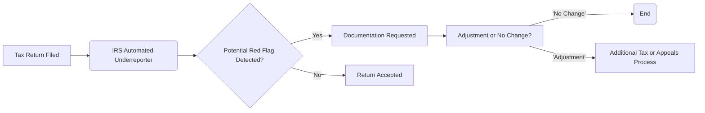

## 25.3 Exam-Triggers & Strategies to Minimize Adjustments

Navigating the world of tax compliance involves not only meticulous return preparation but also awareness of the triggers that may prompt a tax examination (commonly known as an “audit”). The IRS continually refines its methods for identifying returns that may warrant further inspection. A central part of a CPA’s role is to reduce the likelihood of an exam by taking preemptive steps and to ensure that, if an exam does occur, any potential tax adjustments are minimized. This chapter examines the most common red flags, how to mitigate them, and why proper documentation is paramount in defending your tax positions.

---

### Understanding IRS Examination Triggers

While numerous factors contribute to an IRS exam, certain themes recur each tax season. Practitioners must remain vigilant about the areas that the IRS frequently scrutinizes. By recognizing these triggers, CPAs and their clients can adopt best practices, maintain proper records, and stay aligned with the tax code.

#### Large Schedule C Losses

One of the most frequently cited red flags is recurring or significant losses on Schedule C (Profit or Loss from Business). If losses far exceed the norms for a particular industry or persist for multiple years, the IRS may suspect that the activity is more of a hobby than a genuine business.

• Best Practice: Demonstrate a profit motive by keeping business plans, market research, and documentation of efforts to improve profitability.  
• Evidence of commercial viability (e.g., advertising expenses, professional memberships) helps prove the activity is operated with the intention of earning income.

#### High Charitable Contributions Relative to Income

While many taxpayers are generous, the IRS takes notice when charitable deductions are disproportionately large compared to reported income. Overstated or undocumented donations can quickly attract closer inspection.

• Best Practice: Obtain contemporaneous written acknowledgments from charitable organizations, especially for non-cash gifts exceeding legal thresholds.  
• Maintain itemized receipts, appraisals (for high-value or non-cash items), and proof of fair market value.

#### Home Office Deductions & Business Use of Vehicles

Deductions for a home office or business mileage can provide significant tax benefits. However, these are often misused or insufficiently substantiated, prompting frequent IRS scrutiny.

• Best Practice: Maintain logs of business mileage, segregate personal and business use of property, and ensure that the home office meets the “exclusive use” requirement.  
• Track and store relevant utility bills, property tax statements, and other supporting documents.

#### Excessive or Unusual Business Expenses

Claims for certain expenditures—especially travel, meals, entertainment, or “miscellaneous” categories—may raise eyebrows if they appear out of line with the taxpayer’s business profile.

• Best Practice: Keep detailed receipts, itineraries (for travel), and document the time, place, business purpose, and attendees when claiming meal, travel, or entertainment expenses.  
• Use standardized descriptions and consistent categorization to enhance clarity.

#### Non-Cash Contributions & Donations of Property

Deducting vehicles, artwork, or other valuable items can be attractive from a tax perspective. Yet these deductions come with strict substantiation requirements, including independent appraisals and contemporaneous documentation.

• Best Practice: Obtain qualified appraisals for items valued above the IRS thresholds, and ensure the charitable organization provides a complete summary of the donation details.  
• Complete Form 8283 for non-cash contributions exceeding $500, accurately reflecting the fair market value and method of valuation.

#### Cryptocurrency Transactions

Cryptocurrency transactions continue to be an IRS hot topic. The evolving nature of these assets, coupled with confusion about reporting requirements, makes them an emerging audit trigger.

• Best Practice: Keep detailed records of dates, purchase prices, sale prices, and any exchange or wallet details.  
• Carefully track conversions or trades between different cryptocurrencies, as each is potentially a taxable event.

#### Significant Changes in Income or Deductions

If a taxpayer’s income fluctuates sharply or specific deductions spike suddenly, the IRS automated system’s statistical algorithms (DIF score) may flag the return as unusual.

• Best Practice: Prepare a written explanation of any extraordinary circumstances causing the change, such as a large casualty loss, inheritance, or job termination.  
• Ensure that documents—like insurance claims, receipts, or legal settlements—are available to substantiate the fluctuation.

#### Mismatched Income & Information Return Discrepancies

Whenever third-party information returns (Forms W-2, 1099, K-1) do not match the income reported on the tax return, the IRS Automated Underreporter (AUR) system generates a mismatch notice that can escalate into an examination.

• Best Practice: Reconcile any 1099s, W-2s, or K-1s before filing.  
• Monitor for corrected forms, especially from large brokerage accounts or gig economy platforms.

---

### The Critical Role of Thorough Documentation

In every instance where a return might attract additional scrutiny, meticulous documentation can make the difference between a speedy resolution and an expensive, time-consuming audit. Properly maintained records help minimize adjustments by showing that claimed deductions are legitimate, business-related, and adequately substantiated.

1. **Receipts & Invoices**  
   Keep a well-organized electronic or physical filing system. Many tax software programs integrate with scanning solutions, ensuring each expense is directly tied to a record in the system.

2. **Contemporaneous Logs**  
   For areas like mileage, charitable donations, and other regularly incurred expenses, maintain a day-to-day log. This can be as simple as a spreadsheet or a dedicated application that captures relevant details (date, amount, and business purpose).

3. **Accountable Plan Structures**  
   For businesses that reimburse employees for expenses (including the owner in single-member LLCs or S Corps), an accountable plan requires employees to substantiate expenses within a reasonable time frame or return any excess reimbursements. This formal structure helps substantiate legitimate business expenses.

4. **Separating Business & Personal Accounts**  
   Co-mingling business and personal funds raises suspicion and complicates verifying expenses. Maintain distinct bank accounts, credit cards, and accounting records for each entity.

5. **Professional Assessments & Appraisals**  
   For property or intangible asset donations, valuations often require expert assessment. A properly completed appraisal by a qualified professional strengthens the legitimacy of the deduction and reduces potential disagreements with the IRS.

---

### Strategies to Minimize Adjustments

Having identified common exam triggers and recognized the power of robust documentation, the following strategies further reduce the risk of adjustments:

• **Regular Internal Reviews**  
  Conduct mid-year or quarterly reviews of financial statements, ratio analyses (particularly for small businesses with Schedule C), and compliance with known tax code requirements. Early detection of anomalies fosters swift corrections prior to year-end.

• **Engage a Tax Professional**  
  CPA oversight can enhance consistency and accuracy, especially for complex transactions (e.g., real estate exchanges, cryptocurrency trading, or foreign asset reporting). A professional can also help compile necessary substantiation.

• **Maintain Consistency with Industry Norms**  
  It is helpful to compare your or your client’s expense percentages against industry benchmarks (e.g., net profit margins, ratio of travel expenses to total income). Significant deviations should be well-explained and documented.

• **Leverage Safe Harbor Rules**  
  Some tax areas come with safe harbors (e.g., the simplified home office deduction). Utilizing these can minimize audit exposure and reduce complexity.

• **Implement Year-End Tax Planning**  
  As covered in [Chapter 14](../14_ongoing-planning-for-c-corporations) and [Chapter 16](../16_partnership-llc-tax-planning), strategic timing of income and deductions can minimize red flags while optimizing payable tax. Properly planned moves are more likely to be backed by legitimate documentation.

• **Stay Current with Legislative Changes**  
  Tax laws evolve constantly. Pay attention to shifting thresholds, new forms, or guidance clarifications (see [Chapter 20](../20_recent-legislative-developments-sunset) for details on recent legislative changes). Ignorance of new rules may inadvertently trigger an exam.

---

### Sample Workflow Diagram: Documentation & Examination Process

Below is a simple diagram illustrating how the IRS uses automated systems to detect potential inaccuracies and how documentation can avert or mitigate an IRS exam:

**Explanation:**  
1. After a taxpayer files their return (A), the IRS runs automated matching and scoring algorithms (B) to detect disparities.  
2. If the system finds a possible mismatch or high-risk claim (C), the IRS may request documentation (D).  
3. Once documentation is evaluated, results vary from “no change” in tax liability (G) to additional tax owed, which may lead to appeals or further negotiation (H).  

---

### Case Study: High Charitable Deductions & Thorough Substantiation

• **Scenario:** A taxpayer, Ms. Riley, reported charitable donations equaling 25% of her Adjusted Gross Income (AGI). She donated both cash and property to multiple charities. The magnitude of her donations triggered an examination.  
• **Actions Taken:**  
  1. Ms. Riley provided letters from each charity acknowledging each donation.  
  2. She included an appraisal from a qualified professional for the donated property.  
  3. Her financial records contained proof that her income could support the level of charitable giving.  
• **Outcome:** The IRS verified the authenticity of her documentation and closed the exam with no change to her reported deductions.

**Key Takeaway:** Thorough, contemporaneous documentation makes such contributions defendable under IRS scrutiny.

---

### Common Pitfalls & How to Avoid Them

• **Lack of Contemporaneous Records**  
  Relying on reconstructed data months after the fact can lead to inaccuracies. Instead, record deductions as they occur.

• **Misclassification of Expenses**  
  Placing expenses in incorrect categories can inflate or understate deductions, catching the IRS’s attention.

• **Inconsistent Reporting Across Multiple Forms**  
  The IRS matches information across forms W-2, 1099, 1098-T, Schedule K-1, etc. Ensure that each schedule ties correctly so no mismatch prompts an exam.

• **Ignoring Filing Deadlines & Extensions**  
  Late filing may not be a direct exam trigger, but it can subject taxpayers to late payment penalties and additional scrutiny if the IRS believes the taxpayer is trying to hide something.

• **Failure to Use Correct Valuation Methods for Non-Cash Donations**  
  Overstating fair market value can quickly lead to an adjusted return if the taxpayer cannot substantiate its correctness.

---

### References for Further Exploration
1. IRS Publication 334 (Tax Guide for Small Business)  
2. IRS Publication 526 (Charitable Contributions)  
3. IRS Publication 587 (Business Use of Your Home)  
4. IRS Publication 561 (Determining the Value of Donated Property)  
5. AICPA Tax Section – Practice Guides  
6. [Chapter 21: Practice & Procedure](../21_practice-procedure) in this book for additional insights on audits and appeals

---

## IRS Audit Red Flags & Minimizing Adjustment Tactics Quiz



### Which of the following Schedule C items commonly triggers an IRS exam?

- [ ] Excessive personal property tax deductions
- [ ] Small business interest deductions
- [x] Large or recurring losses claimed year after year
- [ ] Low depreciation deductions

> **Explanation:** Repeated or significant Schedule C losses may raise questions about whether the taxpayer is operating a legitimate business or incorrectly reporting a hobby.

### Which of the following is the best first step to substantiate high charitable deductions?

- [ ] Bank statements with generic descriptions
- [x] Contemporaneous written acknowledgments from the donee organization
- [ ] A self-appraisal of donated property
- [ ] Estimates of donated items from memory

> **Explanation:** For both cash and non-cash donations, written acknowledgment from the charity provides the necessary record to validate the contribution.

### When claiming a home office deduction, what is one primary requirement?

- [x] The space must be used exclusively for business.
- [ ] The space must be used for other personal activities.
- [ ] There must be more than one location for the home office.
- [ ] The size of the home must exceed 2,000 square feet.

> **Explanation:** IRS regulations stipulate the home office area must be used exclusively on a regular basis for business.

### Which of the following is a recommended defense against an IRS audit of mileage expenses?

- [x] Maintaining a mileage log detailing date, distance, and business purpose
- [ ] Using round numbers for miles
- [ ] Documenting only monthly totals without further details
- [ ] Handwritten notes for half of all trips

> **Explanation:** A complete, contemporaneously maintained mileage log is key to validating vehicle expenses.

### Which IRS publication can be used to guide appropriate determination of donated property’s fair market value?

- [x] Publication 561
- [ ] Publication 590
- [x] Publication 334
- [ ] Publication 15

> **Explanation:** Publication 561 is dedicated to determining the value of donated property. Publication 334 is helpful for small businesses, but 561 is the definitive resource for non-cash donation valuations.

### If a taxpayer’s income suddenly spikes, which statement is TRUE regarding the potential for an IRS exam?

- [x] The taxpayer may be selected for review due to a significant variance from historical patterns.
- [ ] The taxpayer will automatically owe back taxes.
- [ ] The taxpayer is guaranteed legal penalties.
- [ ] The taxpayer cannot be reviewed if using software to file.

> **Explanation:** Significant anomalies often raise red flags. A spike in income alone doesn’t create a penalty, but it can spark more in-depth scrutiny.

### Which of the following methods helps minimize confusion or reclassification errors in business expenses?

- [x] Maintaining separate business and personal bank accounts
- [ ] Paying for business expenses using personal checks
- [x] Excluding certain large expenses from the books
- [ ] Filing taxes without any supporting documentation

> **Explanation:** Separation of business and personal accounts is critical to maintaining accurate records and legitimizing business expenses.

### What fundamental document is most effective when defending a large meal or entertainment expense?

- [x] A written record with date, amount, venue, and business purpose
- [ ] A phone call transcript with the CPA
- [ ] A manual note stating “large dinner expense”
- [ ] No documentation, as large expenses are typically overlooked

> **Explanation:** Detailed receipts and notes indicating the business purpose and participants are crucial for justifying these expenses.

### For non-cash contributions valued over $5,000, which of the following is typically required?

- [x] A qualified appraisal
- [ ] A simple online tool’s valuation
- [ ] A general ledger entry only
- [ ] No documentation necessary

> **Explanation:** The IRS generally requires a qualified appraisal to substantiate non-cash donations above certain thresholds, especially for items exceeding $5,000.

### Thorough documentation can reduce the risk of an IRS exam leading to an adjustment.

- [x] True
- [ ] False

> **Explanation:** Proper, contemporaneous, and detailed documentation is one of the strongest defenses during an examination, helping validate claimed deductions and credits. 



---

## For Additional Practice and Deeper Preparation

**[TCP CPA Hardest Mock Exams: In-Depth & Clear Explanations](https://www.udemy.com/course/tcp-cpa-mock-exams/?referralCode=675149871D0E79B1699C)**  

**Tax Compliance & Planning (TCP) CPA Mocks:** 6 Full (1,500 Qs), Harder Than Real! In-Depth & Clear. Crush With Confidence! 

- Tackle full-length mock exams designed to mirror real TCP questions.  
- Refine your exam-day strategies with detailed, step-by-step solutions for every scenario.  
- Explore in-depth rationales that reinforce higher-level concepts, giving you an edge on test day.  
- Boost confidence and minimize anxiety by mastering every corner of the TCP blueprint.  
- Perfect for those seeking exceptionally hard mocks and real-world readiness.  

_Disclaimer: This course is not endorsed by or affiliated with the AICPA, NASBA, or any official CPA Examination authority. All content is for educational and preparatory purposes only._
