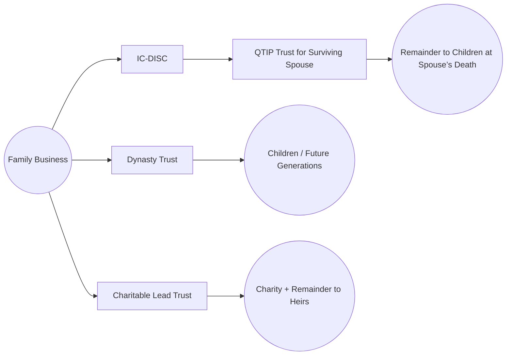

## 27.3 Coordinating Trusts & Entity Structures for Generational Shifts

For many individuals and families, preserving and transferring wealth to future generations is both a logistical hurdle and a deeply personal goal. Advanced estate planning demands a blend of tax, legal, and financial strategies. This often includes coordinating multiple trust vehicles (e.g., QTIP trusts), closely held business entities (e.g., IC-DISCs for export-driven businesses), and philanthropic structures. By synchronizing these instruments, you can help unlock tax efficiencies, protect assets, and meet broader legacy objectives.

Below, we explore the strategic rationale behind such arrangements and provide practical examples to illustrate how you might align trusts, entities, and considerations of governance for the next generation. We also administer best practices and common pitfalls that prospective CPAs need to understand in preparation for the TCP exam—and eventual real-world client engagements.

---

### The Importance of Coordinated Structures

When passing wealth across generations, no single vehicle or approach can cater to every scenario. Families with complex financial situations (e.g., multiple businesses, real estate holdings, or philanthropic endeavors) often use layered strategies to maintain control, minimize tax liabilities, and ensure that future generations are set up for sustained success. Key motivations include:  
• Minimizing estate, gift, and generation-skipping transfer (GST) taxes.  
• Ensuring proper governance and managerial continuity for closely held businesses.  
• Aligning philanthropic goals with tax-favored structures (e.g., charitable trusts).  
• Securing spousal interests while still expanding benefits to children, grandchildren, or other heirs.  

---

### Overview of Common Trust Arrangements

Trusts are legal arrangements designed to manage assets on behalf of beneficiaries. In generational wealth planning, a few specialized trust types recur:

1. **QTIP Trust (Qualified Terminable Interest Property Trust)**  
   A QTIP trust allows the grantor to provide income for a surviving spouse for life while still controlling the ultimate beneficiary designations of the remainder interest. Key benefits:  
   • Estate tax deferral by qualifying for the marital deduction under IRC §2056(b)(7).  
   • Balancing the interests of a surviving spouse with children from a prior marriage.  
   • Allowing the grantor to designate remainder beneficiaries at trust termination (e.g., children from a prior relationship).  

2. **Dynasty Trust**  
   • Designed to endure over multiple generations as permitted by state law.  
   • Minimizes GST taxes through strategic use of lifetime exemptions.  
   • Often accumulates wealth without estate “choke points” in each generation.  

3. **Charitable Remainder Trust (CRT) and Charitable Lead Trust (CLT)**  
   • CRT provides an income stream to the donor or beneficiaries, with the remainder eventually passing to a charity.  
   • CLT directs trust income to charity for a defined term, with the remainder returning to beneficiaries.  
   • Potentially reduces estate taxes, provides immediate charitable deductions, and fosters philanthropic goals.

4. **Revocable Living Trust**  
   • Ensures privacy and continuity in asset management during the grantor’s lifetime.  
   • Does not generally provide immediate estate tax savings but avoids probate complexities.

While QTIP and dynasty trusts are particularly significant for multi-generational planning, the synergy with other entity structures—such as limited partnerships, LLCs, S corporations, and specialized export vehicles (e.g., IC-DISC)—further enhances flexibility and tax efficiencies.

---

### Integrating Business Entities for Cross-Generational Coordination

Estate planners frequently recommend holding family business interests within trusts or related entities to ensure managerial structure, liability protection, and potential tax savings. Popular vehicles include:

1. **FLPs (Family Limited Partnerships)**  
   • Parents often retain general partner positions (controlling interest), while children or trusts hold limited partner interests.  
   • Potential valuation discounts (e.g., due to lack of marketability or minority interest) can lower gift tax or estate tax bases upon transfer of partnership interests.  
   • Creates a central operating entity to manage family-held real estate, operating businesses, or investments.

2. **LLCs (Limited Liability Companies)**  
   • Like FLPs, LLCs can also help in structuring ownership interests among multiple family members or trusts.  
   • More flexible in governance than traditional partnerships.  
   • Can be taxed as partnerships, S corporations, or C corporations depending on elections and structuring.

3. **S Corporations**  
   • Offers pass-through taxation to avoid double taxation at the corporate and shareholder levels.  
   • Certain trusts (e.g., QSSTs and ESBTs) may hold S corporation stock without jeopardizing S corporation election.  
   • Potential for strategic estate-planning moves when allocating income streams to the next generation.

4. **IC-DISC (Interest Charge Domestic International Sales Corporation)**  
   • Special-purpose entity designed to reduce export income tax.  
   • Typically used by U.S. manufacturers or producers who export goods internationally.  
   • Profits may be taxed at favorable dividend rates when distributed to shareholders.  
   • Can integrate with trusts to pass tax-efficient trade income to heirs while benefiting from deferral or lower individual tax rates on qualified dividends.

---

### Combining QTIP Trusts with IC-DISC Structures

A particularly sophisticated arrangement involves pairing a QTIP trust with an IC-DISC to achieve both marital deduction benefits and advantageous tax treatment for export income. Consider a scenario in which a married couple co-owns a family manufacturing business that exports a significant portion of its production:

• **QTIP and Marital Deduction**: Upon the death of the first spouse (often the founder of the business), assets, including shares in the IC-DISC, are held in a QTIP trust for the surviving spouse. The QTIP trust qualifies for the estate tax marital deduction, delaying estate tax until the surviving spouse passes.  

• **IC-DISC Income Flow**: The IC-DISC pays dividend income to the QTIP trust, which then channels the income to the surviving spouse. Because qualified dividends receive preferential tax treatment, the trust and beneficiary may realize a lower effective tax rate on the export-derived profits.  

• **Remainder Beneficiaries**: When the surviving spouse passes, the shares can move to children or grandchildren (or another trust), enabling further generational shifts. Importantly, the original family business structure remains intact, retaining operational continuity and the beneficial tax treatment from the IC-DISC arrangement.

---

### Incorporating Charitable Components

Families with philanthropic aspirations often combine business entities and generational trusts with charitable structures. The synergy among multiple trusts can facilitate:

• **Immediate Income Tax Deductions**: A charitable lead or remainder trust can provide immediate deductions and help reduce overall taxable income in critical years.  
• **Legacy Building**: Families leave a lasting philanthropic imprint, reinforcing values across generations.  
• **Transfer Tax Minimization**: Assets transferred to charitable trusts are often excluded from the grantor’s estate, potentially lowering estate tax liability and ensuring a favorable public legacy.

For instance, a high-net-worth individual could create a **CLT** that receives limited partnership interests in a family LP. Over a specified term, the charity receives the partnership’s distributable cash flow, reducing the estate’s overall value for tax purposes. After that term, the trust’s remaining interest passes to the next generation, potentially with reduced or no estate tax—while the family has also supported meaningful causes.

---

### Diagram: Coordinating Multiple Trusts and Entities

Below is a simplified overview of how various trusts and entities can intersect. This structure exemplifies a scenario in which a family coordinates a QTIP trust, dynasty trust, and charitable entities around a core family business:

• The Family Business (A) spins off income and coordinate export income via an IC-DISC (B).  
• Interests in the business are partially owned by a Dynasty Trust (C) and a Charitable Lead Trust (D).  
• The QTIP Trust (E) receives dividends or distributions from the IC-DISC.  
• At the QTIP Trust’s termination, assets flow to children or other heirs (H).  
• The Charitable Lead Trust (D) allocates periodic gifts to charity while retaining principal for heirs (G).  

---

### Case Study: Coordinating QTIP and Charitable Trusts

**Scenario**: Jack and Diane are in their mid-60s, own a mid-sized export business, and want to ensure a smooth wealth transition to their children while honoring their philanthropic passions.

1. **Step One – Establish IC-DISC**:  
   They incorporate an IC-DISC and transfer export-related revenue streams to it. Tax advantages flow to them in the form of qualified dividends.

2. **Step Two – QTIP Trust for Marital Deduction**:  
   Jack funds a QTIP trust with his share of the IC-DISC. Should Jack pass away first, Diane receives income from the QTIP trust for life. This qualifies for the marital deduction, deferring estate taxes.

3. **Step Three – Charitable Lead Trust (CLT)**:  
   Jack and Diane place certain assets, including real estate and a portion of their business equity, into a CLT. Over 10 years, designated charities receive annual payments. After the 10-year term ends, the remaining trust assets revert to their children, possibly with reduced estate tax consequences due to the initial charitable gift.

4. **Outcome**:  
   • Diane is financially secure through QTIP trust income.  
   • Future generations receive business interests through both direct inheritances and trust remainders.  
   • The family brand is bolstered by identifiable charitable commitments, aligning wealth transfer with philanthropic ideals.

---

### Common Pitfalls and Compliance Challenges

1. **Improper Valuation Discounts**:  
   Overly aggressive valuation discounts for FLP or LLC interests can be challenged by the IRS. Ensure appraisals by qualified professionals to avoid potential controversies and penalties.

2. **Maintaining S Corporation Eligibility**:  
   Trusts holding S corporation stock must meet strict eligibility requirements (e.g., QSST or ESBT). Failure to do so can inadvertently trigger a termination of S corp status, resulting in unexpected tax consequences.

3. **IC-DISC Misuse or Underdocumentation**:  
   The IRS scrutinizes IC-DISCs, especially for correct commission calculations and export definitions. Proper record-keeping and credible economic analysis are essential.

4. **Overlooking the Generation-Skipping Transfer (GST) Tax**:  
   Placing assets into multi-generational trusts without allocating GST tax exemption can yield substantial tax liabilities. Properly track and allocate GST exemptions.

5. **Mismatched Charitable Strategies**:  
   Not all philanthropic trusts lower estate taxes equally. Selecting an inappropriate trust structure or term length can dilate or negate intended tax savings.

6. **Lack of Clear Governance**:  
   A well-conceived plan ensures governance clarity: who controls daily business decisions, trustee duties, oversight committees, and dispute resolution. Ambiguity triggers costly litigation or family infighting.

---

### Best Practices and Strategies

• **Annual Reviews and Collaboration**: Engage regularly with tax professionals, CPAs, attorneys, and financial advisors to keep your plan updated to reflect changes in tax law, family circumstances, or financial markets.  

• **Utilize Lifetime Exemptions and Annual Gifting**: Combine lifetime gift tax exemption strategies with annual gift exclusions ($17,000 per year per donee in 2023; subject to inflation adjustments) to systematically reduce the taxable estate over time.  

• **Realistic Appraisals**: When bringing business interests into trusts or family entities, ensure you have independent, qualified appraisals. A robust paper trail can shield you from undue scrutiny.  

• **Document Business Purpose**: Particularly for FLPs or IC-DISCs, demonstrate legitimate business purposes. Purely tax-motivated setups with no real economic or operational substance can unravel under examination.  

• **Tailor Charitable Structures to Goals**: If the primary goal is to support immediate charitable causes, a charitable lead trust can be powerful. If the older generation needs an income stream, a charitable remainder trust might align better.  

---

### Practical Examination Tips

When studying for the TCP section of the CPA exam, keep these points in mind:

• **Know the Nuances**: QTIP trusts and marital deductions can be tested in various hypothetical scenarios. Practice complicated fact patterns to reinforce your knowledge.  
• **Entity Structuring**: Familiarize yourself with the key differences between S corps, LLCs, FLPs, and how they mesh with trusts in estate planning.  
• **IC-DISC Essentials**: Understand the foundational rules, including the export property requirement, commission calculations, and how IC-DISCs provide a dividend rate advantage.  
• **GST and Charitable Implications**: Comprehend how to allocate GST exemption effectively and how charitable deductions interplay with estate and gift taxes.  
• **Case-Based Questions**: The exam often leverages real-world scenarios that require applying multiple code provisions, especially around marital deductions, charitable deductions, and the interplay of trusts with pass-through or specialized entities.

---

### References for Further Study

• **IRS Publication 950** – Introduction to Estate and Gift Taxes  
• **IRC §§2056, 2518, 2612–2663** – Estate, Gift, and GST Tax Rules  
• **IRC §§991–997** – IC-DISC Provisions  
• **CCH Estate & Gift Tax Reporter** – Detailed interpretative guidance  
• **AICPA’s Tax Section** – Technical practice aids and planning resources  
• **“Estate Planning” by Stephens, Maxfield, Lind & Calfee** – Comprehensive treatise on estate planning laws and techniques  

---

## SEO-Optimized Quiz: Trusts & Entity Structures for Generational Wealth Transfer



### QTIP trusts provide which core benefit in estate planning?

- [x] They allow a surviving spouse to receive income for life while preserving the ultimate distribution for children.
- [ ] They eliminate the need for estate tax returns entirely.
- [ ] They classify all trust income as tax-free.
- [ ] They replace the marital deduction with a charitable deduction.

> **Explanation:** A QTIP trust ensures the surviving spouse receives income while deferring the estate tax until the spouses’ death, at which point the remainder can pass to specified beneficiaries.

### By establishing an IC-DISC, a qualifying U.S. exporter can:

- [x] Pay shareholders (or trust beneficiaries) dividend income subject to lower tax rates.
- [ ] Qualify for a 100% exemption on all export-related income.
- [ ] Defer sales tax liabilities indefinitely.
- [ ] Eliminate the need to file any tax returns on export income.

> **Explanation:** An IC-DISC structure allows export-related profits to be treated as dividends subject to favorable capital gains tax rates. It does not create total exemptions or eliminate filing obligations.

### A Charitable Lead Trust (CLT) is best described as:

- [x] A trust that pays income to one or more charitable organizations for a set term, with the remainder going to non-charitable beneficiaries.
- [ ] A trust used exclusively to avoid capital gains on real estate sales.
- [ ] A trust allowing children to receive tax-free income for a lifetime.
- [ ] A trust requiring the grantor to relinquish all control but not granting any estate tax benefits.

> **Explanation:** A CLT pays the trust’s income to charity for a specified period and then transfers the remaining principal to designated heirs, potentially reducing overall estate tax.

### In a Family Limited Partnership (FLP) structure, the following is generally true:

- [x] The general partner(s) maintain control, while children or trusts hold limited partner interests.
- [ ] Every partner in an FLP must share equal control.
- [ ] FLPs are only suitable for intangible assets like patents and trademarks.
- [ ] FLPs cannot be used in estate planning because of IRS restrictions.

> **Explanation:** Parents often hold controlling general partner interests, and other family members or trusts hold limited partner interests, enabling strategic transfers and potential valuation discounts.

### Which of the following is a common pitfall in coordinating trusts and entities for generational shifts?

- [x] Overly aggressive valuation discounts that lack proper documentation.
- [ ] Using an S corporation to hold trust assets.
- [x] Failing to allocate GST exemption correctly.
- [ ] Setting up an irrevocable trust without a grantor’s signature.

> **Explanation:** Overstating valuation discounts for closely held stock or partnership interests can lead to IRS challenges, and not allocating GST exemption properly is a frequent error in multi-generational planning.

### QTIP and Dynasty Trusts can be distinguished because:

- [x] QTIP provides income for a surviving spouse with remainder beneficiaries, while a Dynasty Trust aims to extend benefits across multiple generations using GST tax exemptions.
- [ ] Only Dynasty Trusts require a married couple to receive income.
- [ ] QTIP trusts are invalid for estate tax planning if funded with stocks.
- [ ] Dynasty Trusts only last for five years at most.

> **Explanation:** QTIP trusts are typically marital trusts that provide for a surviving spouse first. Dynasty Trusts aim to last over several generations, using GST exemptions to bypass estate taxes at each generational level.

### Which is true about S Corporation stock in trust structures?

- [x] Only specific types of trusts (QSST or ESBT) can hold S corporation stock without terminating the S election.
- [ ] Any trust can hold S corporation stock without risk.
- [x] An ineligible trust holding S corp stock triggers conversion to a C corp.
- [ ] S corporations cannot be used in estate planning.

> **Explanation:** The tax code imposes strict requirements for trusts that hold S corporation stock; if these are not met, the S corporation election may be lost.

### An IC-DISC must:

- [x] Primarily derive income from exporting qualifying U.S.-made goods.
- [ ] Generate income only from passive investments.
- [ ] Be formed under state law as an LLC or partnership.
- [ ] Pay no dividend distributions to shareholders.

> **Explanation:** By design, the IC-DISC regime applies to U.S. exporters of goods, offering favorable tax treatment on export profits treated as dividends.

### Charitable Remainder Trusts (CRTs) can provide which key advantage?

- [x] A stream of income to the donor or other beneficiaries, followed by a charitable donation of the remainder.
- [ ] A guarantee of zero capital gains for philanthropic beneficiaries.
- [ ] Unlimited estate tax deductions on foreign investments.
- [ ] Complete elimination of probate requirements.

> **Explanation:** CRTs are designed so the donor or other named individuals receive an annuity or unitrust payment from the trust assets, with the remainder eventually passing to a charitable organization.

### In the context of estate planning, the overarching purpose of “coordinating trusts and entity structures” is:

- [x] True
- [ ] False

> **Explanation:** Coordinating multiple entities and trusts ensures tax efficiency, managerial continuity, and alignment of goals across generations, satisfying both strategic and family needs.



---

## For Additional Practice and Deeper Preparation

**[TCP CPA Hardest Mock Exams: In-Depth & Clear Explanations](https://www.udemy.com/course/tcp-cpa-mock-exams/?referralCode=675149871D0E79B1699C)**  

**Tax Compliance & Planning (TCP) CPA Mocks:** 6 Full (1,500 Qs), Harder Than Real! In-Depth & Clear. Crush With Confidence!

- Tackle full-length mock exams designed to mirror real TCP questions.  
- Refine your exam-day strategies with detailed, step-by-step solutions for every scenario.  
- Explore in-depth rationales that reinforce higher-level concepts, giving you an edge on test day.  
- Boost confidence and minimize anxiety by mastering every corner of the TCP blueprint.  
- Perfect for those seeking exceptionally hard mocks and real-world readiness.  

_Disclaimer: This course is not endorsed by or affiliated with the AICPA, NASBA, or any official CPA Examination authority. All content is for educational and preparatory purposes only._
