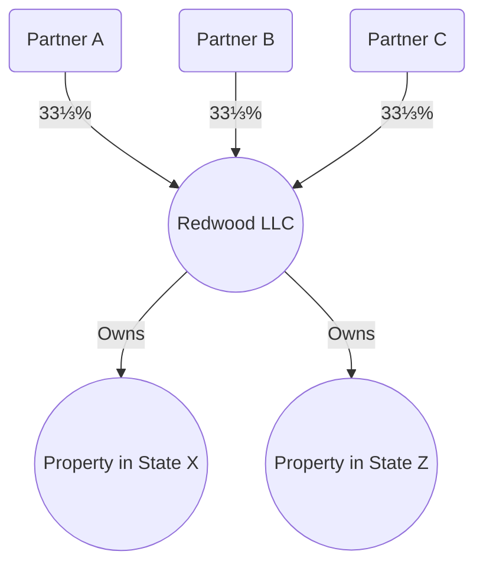
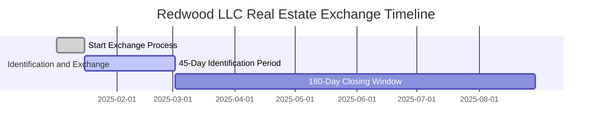
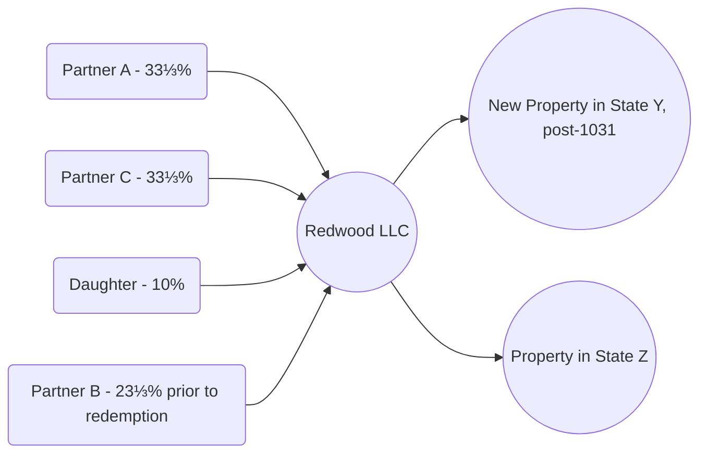

## 28.4 Comprehensive End-to-End Examples & Step-by-Step Calculations

This section unifies many of the advanced concepts covered throughout the book. Specifically, we integrate partnership dynamics, exit events for partners, real estate transactions (including §1031 exchanges), multi-jurisdictional tax concerns, and even estate/gift considerations. Our goal is to help you gain practical insight into how these areas interconnect in a single, cohesive scenario—exactly the kind of comprehensive knowledge you’ll need for the CPA Exam’s Tax Compliance and Planning (TCP) section.

Use the following case studies and examples to sharpen your understanding; you’ll see references to the corresponding chapters for in-depth guidance. Feel free to adapt these case studies to your own practice scenario or exam preparation. Where needed, we highlight common pitfalls and best practices to reinforce your exam-day readiness.

---

### Overview of the Integrated Scenario: Redwood LLC

Imagine Redwood LLC is a partnership formed by three members (classified for tax purposes as a partnership): Partner A, Partner B, and Partner C. Redwood LLC holds commercial real estate properties across multiple states. Each partner’s ownership interest is initially set at one-third (33⅓%) of capital, profits, and losses.

Redwood LLC’s immediate objectives are:  
• To perform a §1031 like-kind exchange on one of its properties located in State X for a newly available property in State Y.  
• To address the exit (redemption) of Partner B, who plans to retire from the venture.  
• To navigate multi-jurisdictional SALT considerations, particularly due to ongoing real estate projects in several states.  
• To consider potential estate/gift tax implications if Partner B gifts a portion of his exit proceeds or Redwood interest to his beneficiaries before fully retiring.  

Below is a high-level flowchart of Redwood LLC’s organizational structure:

As Redwood LLC contemplates exchanging RealEstateX for a property in State Y and also redeeming Partner B’s interest, several advanced tax concepts covered in prior chapters of this book come into play.

---

### Step 1: Setting the Stage – Partner B’s Exit

Partner B’s decision to retire effectively triggers a partial or full redemption of his LLC interest. Before Redwood LLC moves forward, it must determine B’s outside basis in his partnership interest and the corresponding inside basis of Redwood LLC’s assets. This is essential to calculate any potential gain on distribution or redemption.

#### Determining B’s Outside Basis

Partner B’s outside basis depends largely on his initial and subsequent equity contributions, plus his share of partnership income and liabilities, minus previous distributions or allocated losses. Recall from Chapter 11 (Partnerships & LLCs) that we can use a simplified formula for a partner’s outside basis:

$$
\text{Outside Basis}_B = \text{Original Contribution} + \sum(\text{Allocations of Income}) - \sum(\text{Allocations of Loss}) - \text{Distributions} + \text{Partner's Share of Liabilities}
$$

For illustration, assume:  
• Original Contribution: \$200,000.  
• Cumulative Allocations of Income: \$120,000.  
• Cumulative Allocations of Loss: \$40,000 (net of any at-risk or passive restrictions, addressed in Chapter 5).  
• Past Partnership Distributions: \$50,000.  
• Share of Liabilities (e.g., partnership mortgage on the property, lines of credit, etc.): \$30,000.  

Hence, B’s outside basis at the time of redemption stands at:

$$
\text{Outside Basis}_B = \$200{,}000 + \$120{,}000 - \$40{,}000 - \$50{,}000 + \$30{,}000 = \$260{,}000
$$

#### Redemption Mechanics

If Redwood LLC redeems B’s interest for \$400,000, the transaction might result in a gain to B. Typically, the calculation is:

• Amount Realized = \$400,000 (Cash + any other property or relief from liabilities)  
• Basis in Partnership Interest = \$260,000  

Partner B’s tentative gain = \$400,000 - \$260,000 = \$140,000.

However, special rules in Subchapter K (e.g., hot asset considerations if Redwood LLC holds unrealized receivables or inventory items) can transform portions of what might otherwise be capital gain into ordinary income. Also note that Redwood LLC may make a §754 election (discussed below) to adjust the basis of its assets. Turn to Chapter 11.4 (Distributions (Liquidating, Nonliquidating) & Disguised Sales) for details of how partial vs. full liquidations differ from normal distributions.

---

### Step 2: §754 Election Considerations

When a partnership interest is transferred or redeemed, the partnership has the option to make a §754 election. This election allows Redwood LLC to adjust the inside basis of its assets (either up or down) to reflect the purchase price paid (or redemption amount) for B’s partnership interest.

• If Redwood LLC does not make a §754 election, the inside basis of Redwood’s assets remains unchanged.  
• If Redwood LLC makes a §754 election, Redwood LLC may step up the basis in its underlying assets by an amount generally equal to B’s recognized gain (or step down if a loss were recognized).

#### Calculating the §754 Step-Up

If Redwood LLC makes the election, the partnership could increase the inside basis of its assets to reflect the \$140,000 recognized gain by B on his redemption. A portion of that basis step-up might be allocated to Redwood LLC’s real estate holdings, while a portion might be allocated to other assets, based on the rules in §755 for allocating basis adjustments among partnership assets. This helps Redwood LLC and the remaining partners avoid a mismatch between B’s redemption price and the asset basis shared by continuing partners A and C.

Best Practice: Decide on a §754 election based on Redwood LLC’s strategic timing, future dispositions, and the potential for depreciation or amortization benefits. Remember, once made, a §754 election usually remains in place for all subsequent transactions unless revoked with IRS consent.

---

### Step 3: Passive Activity & At-Risk Implications

Real estate activity is often subject to passive activity limitation rules. From Chapter 5, Redwood LLC’s real estate losses (if any) may be limited if the members don’t meet the criteria for real estate professionals. Partner B’s retirement triggers questions about final unleashing of suspended passive losses. Upon full disposition of a passive activity, any suspended losses become deductible in the year of disposition (subject to basis and other constraints).

At the same time, the at-risk rules limit the deductibility of losses to amounts the partners have “at risk” financially. B’s final share of Redwood LLC’s liabilities might drop to zero when his interest is redeemed, impacting any at-risk calculations. Thus, Redwood LLC’s books and B’s final tax return should reflect the partial or full release of at-risk amounts and the recognition of suspended passive losses, if applicable.

---

### Step 4: Conducting a §1031 Like-Kind Exchange

Next, Redwood LLC seeks to exchange RealEstateX (in State X) for a more lucrative commercial property in State Y. Recall from Chapter 17 (Nontaxable Dispositions: §1031 Like-Kind Exchanges) that §1031 allows deferral of gain on certain “like-kind” real estate, provided the requirements, timelines, and property types qualify.

Below is a simple timeline for Redwood LLC’s 1031 process:

1. RealEstateX is sold for \$1,200,000. Redwood LLC identifies a property in State Y within 45 days.  
2. Redwood LLC closes on the new property (the Replacement Property) within the required 180-day window.  
3. Assuming Redwood LLC invests all sale proceeds (boot issues, if any, are addressed below), Redwood generally recognizes no gain. However, any cash not reinvested or used to settle the mortgage difference might result in recognized gain (boot).  

Key points from Chapter 17:  
• The cost basis of the Replacement Property is adjusted downward by any deferred gain.  
• Redwood LLC must follow strict identification and timing rules.  
• If Redwood LLC replaces the property with a lower-value property or receives some non-like-kind property, the difference in value is treated as boot, which can trigger partial gain recognition.

---

### Step 5: Multi-Jurisdictional SALT Considerations

Because Redwood LLC retains commercial real estate in three different states (X, Y, and Z), the partnership must consider a multi-state return filing. Each state might have distinct apportionment or allocation rules for business income, rental income, or gain on property dispositions.

Refer to Chapter 23 (Expanded State & Local Tax (SALT) Topics) for an overview of pass-through entity taxes, elective workarounds for state limitations on SALT deductions, and the intricacies of nexus in multiple jurisdictions.

Pitfall Alert: A common trap is overlooking state-level “boot” or partially nonconforming states that don’t fully follow federal §1031 rules. Ensure Redwood LLC’s recognized gain for state tax purposes aligns with the correct state regulations, as some states are not automatically conforming to federal guidelines.

---

### Step 6: Estate & Gift Integration

Partner B may choose to gift part of his Redwood LLC interest to family members in a trust before or alongside his retirement. This brings gift tax thresholds and unified credit rules into play, discussed in Chapter 6 (Transfers During Life – Gift Taxation & Strategy) and Chapter 27 (Advanced Estate & Gift Integration).

In particular:  
• Valuation Discounts: If Partner B gifts a minority interest in Redwood LLC (less than 50%), discount factors for lack of control or lack of marketability could reduce the effective valuation of that gifted interest.  
• Filing Requirements: B might need to file Form 709 (Gift Tax Return) if the gifts exceed annual exclusion amounts.  
• Estate Freeze Strategies: Redwood LLC might consider shifting additional future appreciation to the next generation, using advanced techniques, such as a Family Limited Partnership (FLP) or Grantor Retained Annuity Trust (GRAT), if Redwood’s operations or real estate values are expected to appreciate significantly.

---

### Step 7: End-to-End Calculation: Putting It All Together

Bringing these steps together, let’s revisit Redwood LLC’s integrated numbers. To illustrate a wide reach of calculations, assume:

1. Basis History for RealEstateX:  
   • Original Cost Basis: \$700,000  
   • Accumulated Depreciation: \$200,000  
   • Adjusted Basis: \$500,000  

2. Sale Price for RealEstateX: \$1,200,000 (deferred via §1031).  
   • Realized Gain for Redwood LLC: \$1,200,000 - \$500,000 = \$700,000.  
   • Gain Deferred Under §1031: \$700,000 (assuming full reinvestment with no boot).  

3. Replacement Property in State Y:  
   • Purchase Price: \$1,300,000  
   • Mortgage: \$300,000 (to fund difference)  
   • Redwood’s new basis in the replacement property: \$500,000 (carryover adjusted basis) + \$100,000 (excess purchase price over proceeds reinvested = \$1.3M - \$1.2M = \$100K) = \$600,000.  
   • Accumulated Depreciation is effectively carried forward, continuing Redwood LLC’s depreciation schedule, with some adjustments under the “exchanged basis” rules from Chapter 17.  

4. Partner B’s Redemption:  
   • Redwood LLC redeems B’s 33⅓% interest for \$400,000.  
   • B’s Outside Basis: \$260,000 (as calculated earlier).  
   • B’s Recognized Gain: \$140,000.  
   • Redwood LLC’s inside basis is adjusted (if §754 election is made). Redwood can increase the basis in its assets by some or all of \$140,000, allocated according to §755 among Redwood’s underlying assets (RealEstateX, RealEstateZ, cash, intangible assets, etc.).  

5. SALT Implications:  
   • Redwood must file partial-year returns in State X for RealEstateX from January 1 until the date of sale (and subsequent exchange).  
   • Redwood must initiate new filing requirements in State Y after acquiring the Replacement Property.  
   • Redwood also remains subject to State Z’s laws for ongoing properties.  
   • Apportionment is determined by each state’s formula (often a combination of property, payroll, and sales). Redwood’s income from real estate rentals is allocated typically to the state where the property is physically located.  

6. Estate & Gift:  
   • Suppose B gifts a 10% LLC interest to his daughter, D, just before redemption.  
   • The fair market value (FMV) of that 10% interest is \$120,000 (assuming minority and marketability discounts have already been applied).  
   • B must file Form 709 if this gift amount, combined with other gifts, exceeds the annual exclusion. However, the lifetime unified credit can absorb a large portion of potential gift tax.  
   • Redwood’s record-keeping now must reflect D as a 10% interest holder for the short period prior to B’s redemption.  

---

### Graphical Representation

Below is a second diagram showing the final Redwood LLC ownership changes. After gifting 10% to D, B retains 23⅓% temporarily. Redwood LLC redeems B’s remaining interest for \$400,000, leaving A, C, and D as continuing partners.

---

### Best Practices & Common Pitfalls

• Always document each step of a §1031 exchange meticulously; missing the 45-day or 180-day deadlines invalidates the deferral.  
• Stay consistent in tracking inside and outside basis. Failures here can cause inaccurate partner-level gain/loss computations.  
• Evaluate §754 elections carefully. They impose administrative complexity on future transactions but often provide advantageous basis adjustments.  
• Recognize that each state can differ significantly in its conformity to federal rules. Resist the temptation to assume uniform state treatment.  
• Communicate consistently with partners regarding potential estate/gift outcomes, especially if interests are being gifted or inherited.  

---

### Additional Practical Examples

• Example 1: If Redwood LLC had received \$50,000 in cash as boot from the §1031 exchange, Redwood would recognize gain to the extent of the lesser between the realized gain and the boot.  
• Example 2: If Redwood LLC had “abandoned” RealEstateX or recognized a partial disposition, some or all the depreciation recapture under §1245 or §1250 might come into play (discussed in Chapter 18).  
• Example 3: If Redwood had intangible assets (like goodwill) recognized in the enterprise, how Redwood LLC allocates the §754 adjustment among tangible and intangible assets can affect future depreciation/amortization.  

---

### Finding Deeper Guidance

For further study, revisit:  
• Chapter 5: Passive Activity & At-Risk Rules – especially relevant if Redwood’s real estate is classified as passive.  
• Chapter 11: Partnerships & LLCs – extensive detail on outside vs. inside basis, partner distributions, guaranteed payments, and disguised sales.  
• Chapter 17: Nontaxable Dispositions – specifics on performing a valid §1031 exchange.  
• Chapter 23: Expanded SALT Topics – especially when Redwood deals with multi-state real estate holdings.  
• Chapter 27: Advanced Estate & Gift Integration – crucial for generational wealth transfers and advanced gifting strategies.

Additionally, consult IRS Publications on Partnerships, consult your state’s department of revenue guidelines for multi-state nexus and apportionment rules, and review judicial precedents regarding redemption and hot asset treatments when relevant.

---

## Mastering Comprehensive End-to-End Tax Calculations: A Quiz for CPA Candidates



### In a partnership redemption, what is Partner B’s recognized gain if the amount realized on the redemption is $400,000 and B’s outside basis is $260,000?

- [ ] $80,000 
- [x] $140,000 
- [ ] $200,000 
- [ ] $400,000 

> **Explanation:** The recognized gain is calculated as Amount Realized ($400,000) minus the Outside Basis ($260,000) = $140,000.

### When a partnership elects under §754 for a partner’s exit event, what generally happens to the partnership’s inside basis?

- [x] The inside basis of the partnership’s assets is adjusted upward or downward. 
- [ ] It remains unchanged unless the partnership is an LLC treated as a corporation. 
- [ ] The inside basis is automatically reset to fair market value for all assets. 
- [ ] The inside basis is adjusted only for unrecaptured §1250 gain. 

> **Explanation:** A §754 election triggers an inside basis adjustment (under §755) to reflect the discrepancy between the exiting partner’s outside basis and the partnership’s inside basis.

### If Redwood LLC sells a property for $1,200,000 with a $500,000 adjusted basis, and all proceeds are reinvested under a valid §1031 exchange, what is the recognized gain for federal tax purposes?

- [ ] $500,000 
- [ ] $700,000 
- [ ] $200,000 
- [x] $0 

> **Explanation:** A valid §1031 exchange with full reinvestment of proceeds defers the entire $700,000 of realized gain.

### Which best describes how suspended passive losses are handled when a partner completely disposes of a passive activity?

- [x] They become fully deductible in the year of disposition, subject to basis limitations. 
- [ ] They expire and can never be used. 
- [ ] They are allocated pro rata to the remaining partners. 
- [ ] They must be spread over five years. 

> **Explanation:** Under the passive activity loss rules, any previously suspended losses are released and fully deductible once a taxpayer completely disposes of the passive activity in a taxable event.

### Which of the following may cause a portion of capital gains from a partnership interest redemption to be classified as ordinary income?

- [x] The presence of hot assets, such as substantially appreciated inventory. 
- [ ] The partner’s personal federal income tax bracket. 
- [x] Unrealized receivables held by the partnership. 
- [ ] The partner’s at-risk limitations. 

> **Explanation:** Unrealized receivables or inventory (hot assets) under §751 can convert what might otherwise be capital gain into ordinary income to the extent those assets are involved.

### What is the primary distinction between inside basis and outside basis in a partnership?

- [x] Inside basis is the partnership’s basis in its assets, while outside basis is each partner’s basis in the partnership interest. 
- [ ] They are the same under all circumstances. 
- [ ] One is used exclusively for book purposes and has no tax impact. 
- [ ] Only outside basis is adjusted by depreciation events. 

> **Explanation:** Inside basis refers to the tax basis the partnership has in its own assets. Outside basis tracks each partner’s basis in the partnership interest. They must be reconciled carefully, particularly upon contributions, distributions, and partnership interest transfers.

### Which state tax consideration is most relevant when the partnership operates in multiple states?

- [x] Nexus and apportionment of income. 
- [ ] Federal carryback limitations. 
- [x] Whether each state conforms to federal §1031 rules. 
- [ ] Strict use of a single-sales factor for all states. 

> **Explanation:** Operating in multiple states triggers questions about nexus (the requirement to file and pay tax) and how income is allocated or apportioned. States may differ in their conformity to federal exchange rules, creating partial or full recognition of gain at the state level.

### If Redwood LLC receives $50,000 in cash (boot) during a partial §1031 exchange, what amount of gain is recognized?

- [ ] $0, as all gain is deferred. 
- [ ] $50,000 is recognized in full, regardless of realized gain. 
- [x] The lesser of the boot or realized gain. 
- [ ] The total realized gain is recognized. 

> **Explanation:** In a §1031 exchange, gain is recognized to the extent of the lesser of the realized gain or the amount of boot received.

### A partner’s at-risk amount is generally increased by which of the following?

- [x] The partner’s share of nonrecourse debt if the partner is personally at risk for repayment. 
- [ ] Guaranteed payments received. 
- [ ] Passive loss allocations. 
- [ ] Return-of-capital cash distributions. 

> **Explanation:** The at-risk amount includes amounts personally liable or guaranteed, including certain forms of nonrecourse debt, if the partner is effectively at risk for the repayment.

### If Partner B gifts 10% of his partnership interest to his daughter before redemption, which form must likely be filed if the gift exceeds the annual exclusion limit?

- [x] Form 709 (U.S. Gift Tax Return) 
- [ ] Form 990-T 
- [ ] Form 1099-DIV 
- [ ] No additional form is required 

> **Explanation:** Gifts exceeding the annual exclusion typically require Form 709 to report the gift for gift tax purposes.



---

## For Additional Practice and Deeper Preparation

[TCP CPA Hardest Mock Exams: In-Depth & Clear Explanations](https://www.udemy.com/course/tcp-cpa-mock-exams/?referralCode=675149871D0E79B1699C)

Tax Compliance & Planning (TCP) CPA Mocks: 6 Full (1,500 Qs), Harder Than Real! In-Depth & Clear. Crush With Confidence!

• Tackle full-length mock exams designed to mirror real TCP questions.  
• Refine your exam-day strategies with detailed, step-by-step solutions for every scenario.  
• Explore in-depth rationales that reinforce higher-level concepts, giving you an edge on test day.  
• Boost confidence and minimize anxiety by mastering every corner of the TCP blueprint.  
• Perfect for those seeking exceptionally hard mocks and real-world readiness.

_Disclaimer: This course is not endorsed by or affiliated with the AICPA, NASBA, or any official CPA Examination authority. All content is for educational and preparatory purposes only._
